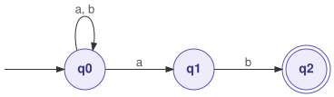
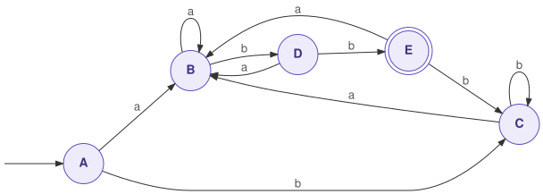
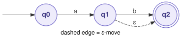
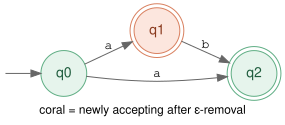
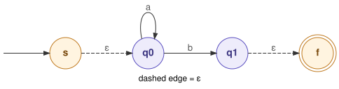
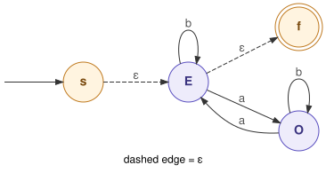

<!--
author:   William Mongan
language: en
narrator: US English Male

comment: Render with https://liascript.github.io/course/?https://raw.githubusercontent.com/BillJr99/Ursinus-CS374-Fall2026/gh-pages/_pages/Activities/liascript-automata-day2.md or locally via https://www.billmongan.com/LiaScript/?https://raw.githubusercontent.com/BillJr99/Ursinus-CS374-Fall2026/gh-pages/_pages/Activities/liascript-automata-day2.md

import: https://raw.githubusercontent.com/liascript/CodeRunner/master/README.md

link:   https://cdn.jsdelivr.net/gh/BillJr99/Ursinus-Boilerplate-Assets@main/css/liascript-custom.css?v=2025-08-23-4
        https://fonts.googleapis.com/css2?family=Lexend+Deca&display=swap

-->

# Finite Automata, Day 2: Nondeterminism and Equivalence

Day 1 built deterministic machines and traced them by hand.  Today the machine is allowed to guess.  We then show that guessing adds no power: the subset construction turns any nondeterministic machine into a deterministic one.  Finally we close the loop, turning a deterministic machine back into a regular expression, so that the whole chain ε-NFA → NFA → DFA → regex preserves the language at every step.  This theorem is the reason your lexer can use regular expressions and still run in linear time.

> This is the second of two sessions on this topic.  If you have not done Day 1, start there: [Finite Automata](https://www.billmongan.com/LiaScript/?https://raw.githubusercontent.com/BillJr99/Ursinus-CS374-Fall2026/gh-pages/_pages/Activities/liascript-automata.md).

# Part II: Nondeterminism and Equivalence (Day 2)

## 3.  NFAs: Generous Machines

A **nondeterministic finite automaton (NFA)** is a finite automaton with relaxed rules.  A state may have several arrows for one symbol, or none at all.  A state may also have an epsilon transition: an arrow the machine follows without reading any input.  In symbols, $\delta: Q \times (\Sigma \cup \{\varepsilon\}) \rightarrow \mathcal{P}(Q)$, so the transition function returns a set of states instead of one state.  An NFA accepts a string if any sequence of choices ends in an accepting state.  Picture the machine following every option at the same time.

NFAs are usually much easier to design than DFAs.  The "ends in `ab`" NFA is three states in a line with one self-loop.  Regular expressions also compile into NFAs naturally: concatenation chains two machines, `|` forks with epsilon arrows, and `*` loops back with epsilon arrows.  That recipe is Thompson's construction.

NFAs are no more powerful than DFAs.  The subset construction converts any NFA into a DFA.  Each DFA state is a set of NFA states, and that set records everywhere the NFA could be.  Two machines (or a machine and a regex) are equivalent when they accept exactly the same strings.  The construction gives a chain of equivalences:

$$
\text{regex} \equiv \text{NFA} \equiv \text{DFA}
$$

Models 4 and 4b make each arrow of that equivalence concrete, as a chain of conversions: $\varepsilon\text{-NFA} \rightarrow \text{NFA} \rightarrow \text{DFA} \rightarrow \text{regex}$.

The price of determinism is a worst-case exponential number of states ($2^{|Q|}$ subsets).  This is a classic trade among time, space, and simplicity.

> **Watch out!**  NFAs and DFAs recognize *exactly the same class of languages*; neither is more powerful.  NFAs are only more *compact to write*: the ends-in-`ab` NFA needs 3 states and the equivalent DFA needs 4.  The subset construction proves the equivalence; we do not assume it.

An NFA has 4 states.  The subset-construction DFA recognizing the same language has at most:

[( )] 4 states
[( )] 8 states
[(X)] 16 states, one per subset of the NFA's states
[( )] Unboundedly many states

The NFA "ends in ab" has 3 states: start/loop (q0), saw-a (q1), saw-ab (q2).  The nondeterminism is at q0 on input 'a': the machine can stay in q0 (still looping) OR move to q1 (guessing that the ending starts here).  This nondeterminism means:

[( )] The machine will fail on inputs where multiple paths exist
[( )] The machine requires exponential time to simulate
[(X)] The machine accepts if ANY choice of path leads to an accepting state
[( )] The machine requires the programmer to specify which path to take

---

## Model 3: NFA Simulation

Simulating an NFA does not require any magic or backtracking.  Instead of one current state, the simulator tracks the *set* of all states the NFA could be in right now.  That set holds every live path at once.  Each input symbol advances every state in the set, and the simulator unions the results.  This is the subset construction run lazily, one character at a time.  It costs at most $O(k)$ work per symbol for a $k$-state NFA.

```python
# NFA simulation by tracking the SET of possible states: the subset
# construction performed lazily, one input symbol at a time.

ENDS_IN_AB_NFA = {
    "start": frozenset({"q0"}),
    "accept": frozenset({"q2"}),
    "delta": {                       # sets of successor states
        ("q0", "a"): frozenset({"q0", "q1"}),  # loop OR guess ending starts
        ("q0", "b"): frozenset({"q0"}),
        ("q1", "b"): frozenset({"q2"}),
        # no transition from q2: it's a dead end (accepting, but no moves)
    },
}

def run_nfa(machine, s, trace=False):
    current = set(machine["start"])
    if trace: print("  start: " + "{" + ", ".join(sorted(current)) + "}")
    for ch in s:
        nxt = set()
        for state in current:
            nxt |= machine["delta"].get((state, ch), frozenset())
        current = nxt
        if trace: print(f"  '{ch}' -> " + "{" + ", ".join(sorted(current)) + "}")
        if not current:
            if trace: print(f"  DEAD STATE (all paths exhausted)")
            return False
    accepted = bool(current & machine["accept"])
    if trace: print(f"  -> {'ACCEPT' if accepted else 'REJECT'}")
    return accepted

print("=== NFA: ends-in-ab ===")
for s in ["ab", "aab", "abab", "ba", "a", "b", "aabb", ""]:
    print(f"  {s!r:7} -> {run_nfa(ENDS_IN_AB_NFA, s)}")

print("\n=== Trace of 'aab' ===")
run_nfa(ENDS_IN_AB_NFA, "aab", trace=True)
```
@LIA.eval(`["main.py"]`, `none`, `python3 main.py`)

> **Watch out!**  An NFA does not "guess" which path to take; that phrasing makes it sound like luck is involved.  The machine *explores all paths at once*, and it accepts if *any* of them reaches an accepting state.  The simulation above makes this concrete: `current` is always a set, never a single lucky choice.

### Reading the Code

- The simulator never backtracks and never guesses.  It carries a set of states and advances all of them at once.  That is why an NFA runs in time proportional to the input rather than exponentially.
- That set is a DFA state in disguise.  Model 4 names each set ahead of time; here the same sets are computed lazily, one input symbol at a time.
- Acceptance is a set-intersection test: accept if *any* reachable state is accepting.  "The machine may guess" means nothing more than that, made deterministic.
- A missing entry in `delta` means that path dies.  Because we track a set, one dead path does not end the run; the others carry on.

### Try It Yourself

Build an NFA of your own and watch the state set grow and shrink.

```python
def run_nfa(machine, s, trace=False):
    current = set(machine["start"])
    if trace:
        print("    start: " + "{" + ", ".join(sorted(current)) + "}")
    for ch in s:
        nxt = set()
        for st in current:
            nxt |= set(machine["delta"].get((st, ch), ()))
        current = nxt
        if trace:
            shown = ", ".join(sorted(current)) if current else "(dead)"
            print(f"    after {ch!r}: " + "{" + shown + "}")
        if not current:
            break
    return bool(current & set(machine["accept"]))

# Accepts strings over {a, b} that CONTAIN "aba" anywhere.
CONTAINS_ABA = {
    "start":  frozenset({"q0"}),
    "accept": frozenset({"q3"}),
    "delta": {
        ("q0", "a"): frozenset({"q0", "q1"}),   # stay, or guess "aba" starts here
        ("q0", "b"): frozenset({"q0"}),
        ("q1", "b"): frozenset({"q2"}),
        ("q2", "a"): frozenset({"q3"}),
        ("q3", "a"): frozenset({"q3"}),         # once accepted, stay accepted
        ("q3", "b"): frozenset({"q3"}),
    },
}

print("=== contains 'aba' ===")
for s in ["aba", "bbabab", "abba", "aab", ""]:
    print(f"  {s!r:9} -> {run_nfa(CONTAINS_ABA, s)}")

print("\n=== watch the state set on 'bbaba' ===")
run_nfa(CONTAINS_ABA, "bbaba", trace=True)

# TODO 1: in the trace, find the step where the set holds TWO states. What
#         are the machine's two hypotheses at that moment, in English?

# TODO 2: build an NFA for strings that END in "ab" OR END in "ba".
#         Hint: one start state with two guesses. Test it on
#         "ab", "ba", "aab", "abb", "b", "".

# TODO 3: how many states did your NFA need? Now sketch the DFA for the
#         same language and count ITS states. Which was easier to design?
```
@LIA.eval(`["main.py"]`, `none`, `python3 main.py`)

Expected output: `aba` and `bbabab` accepted; `abba`, `aab` and the empty string rejected.  In the trace, `{q0, q1}` is the machine believing two things at once: "this `a` begins an `aba`" and "it does not".

### Critical Thinking Questions

8.  Trace `aab` by hand, writing the *set* of states after each symbol.  Where does the machine "hedge its bets," and which bet pays off?
9.  Compare the NFA's three states with the DFA for the same language.  Which was easier to design, and which is cheaper to run per input symbol?
10.  The simulation tracks sets, so it runs the subset construction on the fly.  For an NFA with $k$ states, bound the work per input character ($O(k)$ per symbol).  Why do we still call this fast?

---

## The Conversion Chain: ε-NFA → NFA → DFA → Regular Expression

Model 4 and Model 4b walk through a chain of conversions.  It fits together like this:

$$
\varepsilon\text{-NFA} \rightarrow \text{NFA} \rightarrow \text{DFA} \rightarrow \text{Regular Expression}
$$

**Each step preserves the language recognized by the automaton.**  Nothing is gained or lost along the way; only the *form* changes.  Thompson's construction closes the loop in the other direction (regex → ε-NFA), so all four notations describe exactly the same class of languages.

The useful question to carry through every conversion is *what structure does this step remove?*  Each one removes a different kind:

| Conversion | What it removes | How it accounts for what was removed |
|---|---|---|
| ε-NFA → NFA | **free transitions** (moves that read no input) | follow them before and after every real symbol: $E(q) \rightarrow a \rightarrow E(\cdot)$ |
| NFA → DFA | **multiple possible current states** | the DFA stores all possible NFA states at once, as one set such as $\{q_1, q_3, q_7\}$ |
| DFA → regex | **explicit automaton states** | paths through the machine are written algebraically, using union, concatenation, and star |

For each conversion below, we follow the same four beats: the **rationale** (why we want that structure gone), the **algorithm** (the steps and the one formula that drives them), the **intuition** (the sentence to remember when the formula is not in front of you), and **examples** (always more than one).  You can do ε-NFA → DFA in a single pass, too: the "directly" route below combines the first two steps.

---

## Model 4: Subset Construction, NFA -> DFA

The subset construction is the idea that connects NFAs to DFAs.  Each DFA state is a *frozenset* of NFA states: "the set of places the NFA could be after reading this much input."  The algorithm is a reachability search over those sets, and it builds the DFA transition table as it goes.  Once you read the code, you will see that Model 3's simulation was already doing this on every input string, without naming the sets.

We run it by hand first, on the NFA that Thompson's construction builds for `(a|b)*abb`, and then read the same steps as code.

### NFA → DFA: Rationale, Algorithm, and Intuition

**Rationale.**  An NFA may have several arrows for one symbol, so after reading some input it could be in *several* states at once.  A DFA is only allowed one current state.  We need a way to keep every possibility alive while still taking exactly one step per symbol.

Suppose the NFA is

$$
N = (Q, \Sigma, \delta, q_0, F)
$$

where $\delta(q, a)$ may return **multiple possible states**.  The main idea is:

> **A DFA state represents a set of possible NFA states.**

For example, if the NFA could currently be in $q_1$, $q_2$, or $q_4$, the corresponding DFA state is the single state $\{q_1, q_2, q_4\}$.

**Algorithm (subset construction).**

1. Create the DFA start state $\{q_0\}$.
2. For every DFA state $S \subseteq Q$ and every symbol $a \in \Sigma$, compute

   $$
   \boxed{\delta_D(S, a) = \bigcup_{q \in S} \delta_N(q, a)}
   $$

3. Every new set of states discovered becomes a new DFA state.
4. Repeat until no new state sets are discovered.
5. A DFA state is accepting if it contains at least one accepting NFA state: $S \cap F \neq \emptyset$.

**Intuition.**  *Take the union of every place the NFA could go.*  The DFA does not guess; it remembers every guess at once.

**Example 1: a warm-up with one symbol.**  Suppose $\delta(q_0, a) = \{q_0, q_1\}$ and $\delta(q_1, a) = \{q_2\}$, with $q_2$ accepting.  Start with $A = \{q_0\}$.  On input `a`, $\delta_D(A, a) = \{q_0, q_1\}$; call this state $B$.  Now process `a` from $B$:

$$
\begin{aligned}
\delta_D(B, a) &= \delta(q_0, a) \cup \delta(q_1, a) \\
               &= \{q_0, q_1\} \cup \{q_2\} \\
               &= \{q_0, q_1, q_2\}.
\end{aligned}
$$

Call this state $C$, then continue the same process.  From $C$ on `a`: $q_0$ gives $\{q_0, q_1\}$, $q_1$ gives $\{q_2\}$, and $q_2$ has no `a` arrow, so the union is $\{q_0, q_1, q_2\} = C$ again.  No new sets appear, so we stop: three DFA states, and only $C$ accepts, because only $C$ contains $q_2$.  Read off what each remembers: $A$ has read nothing, $B$ has read one `a`, and $C$ has read at least two.

> **Key idea.**  A DFA state is a set of possible NFA states.  An NFA with $n$ states can theoretically produce as many as $2^n$ DFA states, because the DFA states are subsets of the NFA states.  Usually far fewer are reachable.

### A Small Example First: "Ends in `ab`"

This is **Example 2** for NFA → DFA.  Before the eleven-state example, run the construction on a machine small enough to hold in your head.  This NFA accepts strings over `{a, b}` that end in `ab`.  It starts in `q0`, accepts in `q2`, and its only nondeterministic moment is `q0` on `a`, where it can stay put or bet that this `a` begins the ending:



| NFA state | on `a` | on `b` |
|---|---|---|
| → q0 | {q0, q1} | {q0} |
| q1 | ∅ | {q2} |
| **q2** (accepting) | ∅ | ∅ |

There are no ε-moves here, so the rule is short.  A DFA state is a set of NFA states.  Begin with `{q0}`.  For each set you have not processed yet and each symbol, the next set is the union of every arrow leaving that set on that symbol.  A set accepts when it contains `q2`.

```text
{q0}      on a:  q0 -> {q0, q1}                 gives {q0, q1}   new
          on b:  q0 -> {q0}                     gives {q0}
{q0, q1}  on a:  q0 -> {q0, q1},  q1 -> none    gives {q0, q1}
          on b:  q0 -> {q0},      q1 -> {q2}    gives {q0, q2}   new
{q0, q2}  on a:  q0 -> {q0, q1},  q2 -> none    gives {q0, q1}
          on b:  q0 -> {q0},      q2 -> none    gives {q0}
no unprocessed sets remain, so the construction stops
```

| DFA state | on `a` | on `b` | what it remembers |
|---|---|---|---|
| → A = {q0} | B | A | the last symbol was not an `a` |
| B = {q0, q1} | B | C | the last symbol was an `a` |
| **C = {q0, q2}** (accepting) | B | A | the input just ended in `ab` |


Trace `aab`: A on `a` goes to B, B on `a` stays in B, and B on `b` goes to C, which accepts.  Three NFA states became three DFA states, so this language costs nothing to determinize.

### ε-NFA → DFA Directly: Rationale, Algorithm, and Intuition

**Rationale.**  An ε-transition lets the automaton change states **without consuming an input symbol**.  The subset construction above only knows how to follow arrows labeled with real symbols, so it would miss every state the NFA can slide into for free.  You do **not** need to build an intermediate ε-free NFA first: you can combine ε-closure with the subset construction.

The central concept is the **epsilon closure**.  Define

$$
E(q) = \varepsilon\text{-closure}(q),
$$

which means *all states reachable from $q$ using zero or more ε-transitions*.  Because zero transitions are allowed, $q \in E(q)$ always.  For example, if $q_0 \xrightarrow{\varepsilon} q_1$ and $q_1 \xrightarrow{\varepsilon} q_2$, then $E(q_0) = \{q_0, q_1, q_2\}$.  For a set, $E(S)$ is the union of $E(q)$ over every $q \in S$.

**Algorithm.**

- *Start state.*  Instead of starting with $\{q_0\}$, start with $E(q_0)$.  If $E(q_0) = \{q_0, q_1, q_2\}$, the DFA begins in $\{q_0, q_1, q_2\}$ rather than simply $\{q_0\}$.
- *Transition rule.*  For a DFA state $S$ and symbol $a$:

  $$
  \boxed{\delta_D(S, a) = E\left(\bigcup_{q \in S} \delta(q, a)\right)}
  $$

The procedure is: (1) start with an epsilon-closed set, (2) consume one input symbol, (3) take the epsilon closure again.  Accepting states are the same as before: any set containing an accepting NFA state.

**Intuition.**  *Move, then epsilon-close.*  Every DFA state is a set that has already absorbed every free move, so the next real symbol starts from everywhere the machine could possibly be.

**Example 1: a small one.**  Take $q_0 \xrightarrow{\varepsilon} q_1$, $q_1 \xrightarrow{a} q_2$, $q_2 \xrightarrow{\varepsilon} q_3$, with $q_3$ accepting.  The start state is $E(q_0) = \{q_0, q_1\}$, not $\{q_0\}$.  On `a`, the move from that set is $\{q_2\}$, and closing it gives $\{q_2, q_3\}$, which accepts because it contains $q_3$.  From $\{q_2, q_3\}$ there are no `a` moves at all, so the next state is $\emptyset$, a dead state.  The DFA accepts exactly the string `a`.  Had we started from $\{q_0\}$ without closing, the `a` arrow out of $q_1$ would have been invisible, and the DFA would accept nothing.

**Example 2** is the classic one, worked in full next.

### Worked Example: Subset Construction by Hand, with ε-closure

This is the classic example from the *Dragon Book* (Aho, Lam, Sethi, and Ullman).  Thompson's construction turns `(a|b)*abb` into the 11-state NFA below: states 0 through 7 are the `(a|b)*` loop, and 7 → 8 → 9 → 10 spells out `abb`.  State 10 is the only accepting state, and every blank cell is "no move."

| NFA state | on `a` | on `b` | on ε |
|---|---|---|---|
| → 0 | | | 1, 7 |
| 1 | | | 2, 4 |
| 2 | 3 | | |
| 3 | | | 6 |
| 4 | | 5 | |
| 5 | | | 6 |
| 6 | | | 1, 7 |
| 7 | 8 | | |
| 8 | | 9 | |
| 9 | | 10 | |
| **10** (accepting) | | | |

The same machine drawn out.  The upper branch reads `a` (2 → 3), the lower branch reads `b` (4 → 5), the ε-edge 6 → 1 repeats the loop, and the ε-edge 0 → 7 skips it entirely, which is how `(a|b)*` allows zero repetitions:


Two operations do all of the work:

- **ε-closure(S)**: every state reachable from the set `S` by following ε-moves alone, including the states of `S` themselves.  Compute it as a small graph search, and stop following a state once it is already in the set; that check is what keeps the 6 → 1 back edge from looping forever.
- **move(S, x)**: the set of states reachable from `S` by exactly one `x` transition.

A DFA state is `ε-closure(move(S, x))`, one per unprocessed set and symbol.  Forgetting the closure, either at the start or after a move, is the most common mistake in this construction.

**Step 0: the start state.**  From 0, the ε-moves reach 1 and 7, and from 1 they reach 2 and 4.  None of those has further ε-moves, so

`A = ε-closure({0}) = {0, 1, 2, 4, 7}`

**Step 1: process A.**

- on `a`: `move(A, a) = {3, 8}`, because 2 goes to 3 and 7 goes to 8.  Closing it: 3 → 6 → 1, 7, and 1 → 2, 4, which gives `{1, 2, 3, 4, 6, 7, 8}`.  That set is new: call it **B**.
- on `b`: `move(A, b) = {5}`.  Closing it: 5 → 6 → 1, 7 → 2, 4, which gives `{1, 2, 4, 5, 6, 7}`.  Also new: **C**.

**Step 2: process B.**

- on `a`: `move(B, a) = {3, 8}` again, whose closure is B itself.  Nothing new.
- on `b`: `move(B, b) = {5, 9}`, because 4 goes to 5 and 8 goes to 9.  The closure is `{1, 2, 4, 5, 6, 7, 9}`: new, **D**.

**Step 3: process C.**  On `a`, `move(C, a) = {3, 8}`, which closes to B.  On `b`, `move(C, b) = {5}`, which closes to C.  Nothing new.

**Step 4: process D.**  On `a` it goes to B, as before.  On `b`, `move(D, b) = {5, 10}`, which closes to `{1, 2, 4, 5, 6, 7, 10}`: new, **E**.  E contains 10, the NFA's accepting state, so **E is accepting**.

**Step 5: process E.**  On `a` it goes to B, and on `b`, `move(E, b) = {5}` closes to C.  Nothing new, and no unprocessed sets remain, so the construction is finished.

| DFA state | NFA states | on `a` | on `b` | accepting? |
|---|---|---|---|---|
| → A | {0, 1, 2, 4, 7} | B | C | no |
| B | {1, 2, 3, 4, 6, 7, 8} | B | D | no |
| C | {1, 2, 4, 5, 6, 7} | B | C | no |
| D | {1, 2, 4, 5, 6, 7, 9} | B | E | no |
| E | {1, 2, 4, 5, 6, 7, 10} | B | C | **yes** |

The same DFA as a diagram (the double circle marks the accepting state):



Eleven NFA states could have produced up to 2^11 = 2048 subsets.  The construction reached only five.  Read what each one remembers: B is "just read `a`," D is "just read `ab`," E is "just read `abb`," and A and C both mean "no part of `abb` in progress."  A and C behave identically on every input, so DFA minimization would merge them into a single state, leaving four.

Trace `babb` to check the table: A →b C →a B →b D →b E, which ends in an accepting state.  Trace `abab`: A →a B →b D →a B →b D, which does not.

`move(B, b) = {5, 9}`.  Which DFA state is `ε-closure({5, 9})`?

[( )] `{5, 9}`, because there is nothing left to add
[( )] `{1, 2, 4, 5, 6, 7, 9, 10}`
[(X)] `{1, 2, 4, 5, 6, 7, 9}`, the state D
[( )] `{6, 9}`
***********************************************************************

From 5, the ε-moves go to 6 and then to 1 and 7, and from 1 to 2 and 4.  State 9 has no ε-moves, and 9 → 10 needs a `b`, so 10 is not in the closure.  That is D.  Leaving the set at `{5, 9}` is the "forgot the closure" mistake.

***********************************************************************

Which DFA states are accepting?

[( )] Only the start state A
[( )] Every state that contains state 7
[(X)] Exactly the states whose set contains 10, which is only E
[( )] D and E, because both are near the end of `abb`
***********************************************************************

A DFA state accepts exactly when its set contains an accepting NFA state, and only E contains 10.

***********************************************************************

> **Check it yourself.**  Enter the NFA above into [Automata Studio](https://reyescarlata0.github.io/automata-studio/), which prints the full subset table and then minimizes the DFA, and watch A and C merge.  The [FSM Simulator](https://ivanzuzak.info/noam/webapps/fsm_simulator/) steps the same NFA one symbol at a time (it writes ε as `$`), and each set of active states it highlights is one row of the table above.  The Automata lab's Step 3.1 asks for this same kind of trace on your own Contains-aa NFA.

### Removing ε-Moves First: From an ε-NFA to an Ordinary NFA

The worked example folds the ε-moves into the subset construction: every time it builds a DFA state, it closes the set.  There is a second route that does the same work in two separate steps.  First remove the ε-moves, producing an ordinary NFA with the same states and the same language.  Then run the plain subset construction, the one in the code below that never calls a closure.  Separating the steps is useful when a tool or an algorithm only accepts NFAs without ε-moves, and it makes the role of ε-closure easier to see.

**Rationale.**  Some tools and proofs only accept NFAs without ε-moves.  Removing them is also the clearest way to see exactly what an ε-transition contributes: every real step the machine can take, once the free moves before and after it are counted.

**Algorithm.**  When processing a normal input symbol $a$, think:

$$
\boxed{\text{epsilon before} \rightarrow a \rightarrow \text{epsilon after}}
$$

Formally,

$$
\delta'(q, a) = E\left(\delta(E(q), a)\right),
$$

and expanded,

$$
\delta'(q, a) = \bigcup_{p \in E(q)} \; \bigcup_{r \in \delta(p, a)} E(r).
$$

**Intuition.**  Conceptually, if

$$
q \xrightarrow{\varepsilon^*} p \xrightarrow{a} r \xrightarrow{\varepsilon^*} s,
$$

then the ε-free NFA should include the single arrow $q \xrightarrow{a} s$.  We are drawing shortcuts: every path that reads exactly one real symbol, however many free moves surround it, becomes one direct arrow.

**Updating accepting states.**  This step is important.  If an accepting state can be reached from $q$ using only ε-transitions, then $q$ must also become accepting:

$$
q \in F' \iff E(q) \cap F \neq \emptyset.
$$

For example, if $q_0 \xrightarrow{\varepsilon} q_f$ and $q_f$ is accepting, then $q_0$ must also be accepting in the ε-free NFA; otherwise the empty string, which the original accepts by sliding to $q_f$, would be lost.

**Example 1: shortcut arrows.**  Suppose $q_0 \xrightarrow{\varepsilon} q_1$, $q_1 \xrightarrow{a} q_2$, and $q_2 \xrightarrow{\varepsilon} q_3$, with $q_3$ accepting.  First, $E(q_0) = \{q_0, q_1\}$.  From those states, consuming `a` reaches $\{q_2\}$.  Then $E(q_2) = \{q_2, q_3\}$.  Therefore the ε-free NFA receives the transitions $q_0 \xrightarrow{a} q_2$ and $q_0 \xrightarrow{a} q_3$.  The same reasoning from $q_1$ gives $q_1 \xrightarrow{a} q_2$ and $q_1 \xrightarrow{a} q_3$.  For accepting states: $E(q_2) = \{q_2, q_3\}$ contains $q_3$, so $q_2$ becomes accepting too.

The full procedure, step by step, follows.

The construction keeps every state and the start state, and it rebuilds the transitions and the accepting set:

- **New transitions.**  For each state $q$ and symbol $x$, $\delta'(q, x) = \varepsilon\text{-closure}(\text{move}(\varepsilon\text{-closure}(\{q\}), x))$.  In words: slide along ε-edges from $q$ as far as they go, take one real `x` step, then slide along ε-edges again.
- **New accepting states.**  A state $q$ accepts in the new NFA when $\varepsilon\text{-closure}(\{q\})$ contains an accepting state of the original, because the original could reach acceptance from $q$ without reading anything more.

**Example 2: `ab?`.**  This ε-NFA accepts an `a`, optionally followed by a `b`.  It starts in `q0` and accepts in `q2`, and the dashed ε-edge is what makes the `b` optional:



| state | on `a` | on `b` | on ε |
|---|---|---|---|
| → q0 | {q1} | | |
| q1 | | {q2} | {q2} |
| **q2** (accepting) | | | |

*Step 1, the closure of each state.*  Each state, plus everything it reaches by ε-moves alone: `ε-closure(q0) = {q0}`, `ε-closure(q1) = {q1, q2}`, `ε-closure(q2) = {q2}`.

*Step 2, the new arrows,* from $\delta'(q, x) = \varepsilon\text{-closure}(\text{move}(\varepsilon\text{-closure}(\{q\}), x))$:

```text
δ'(q0, a) = ε-closure(move({q0}, a))       = ε-closure({q1}) = {q1, q2}
δ'(q0, b) = ε-closure(move({q0}, b))       = ε-closure(∅)    = ∅
δ'(q1, a) = ε-closure(move({q1, q2}, a))   = ∅
δ'(q1, b) = ε-closure(move({q1, q2}, b))   = ε-closure({q2}) = {q2}
δ'(q2, a) = δ'(q2, b) = ∅
```

*Step 3, the new accepting states.*  A state accepts if its closure holds an old accepting state.  The closure of `q1` contains `q2`, so `q1` now accepts, and `q2` still does.  This is the step that is easiest to forget, and forgetting it has a visible cost: the string `a` ends in `q1`, so without it `a` would be rejected.

| state | on `a` | on `b` |
|---|---|---|
| → q0 | {q1, q2} | ∅ |
| **q1** (accepting) | ∅ | {q2} |
| **q2** (accepting) | ∅ | ∅ |



Check it: `a` takes `q0` to `{q1, q2}`, which accepts; `ab` goes on to `{q2}`, which accepts; `b` has nowhere to go from `q0`, so it is rejected.  That is exactly `ab?`.  Notice that the result is still nondeterministic, since `q0` on `a` reaches two states, so the last step is the subset construction from the "ends in `ab`" example.  The other route skips ε-removal entirely and closes as it goes, as the worked example above does: a DFA state is `ε-closure(move(S, x))`, and the start set is closed too.

The same three steps scale to the eleven-state NFA.

**Example 3: worked rows, on the eleven-state NFA.**  Three rows show every case:

- State 0.  `ε-closure({0}) = {0, 1, 2, 4, 7}`.  On `a`, the move from that set is `{3, 8}`, which closes to `{1, 2, 3, 4, 6, 7, 8}`.  On `b`, the move is `{5}`, which closes to `{1, 2, 4, 5, 6, 7}`.  Those are exactly B and C from the worked example, as they should be.
- State 2.  `ε-closure({2}) = {2}`.  On `a`, the move is `{3}`, which closes to `{1, 2, 3, 4, 6, 7}`.  On `b`, there is no move at all, so the new transition is the empty set.
- State 7.  `ε-closure({7}) = {7}`.  On `a`, the move is `{8}`, and 8 has no ε-moves, so the result is `{8}`.  On `b`, nothing.

Only state 10 accepts, because no other state's closure reaches 10.  In particular, state 0 does not accept, so the empty string is still rejected, as `(a|b)*abb` requires.

## Code Cell: ε-Removal

The cell computes every row, then checks that the new NFA agrees with the original on every string over `{a, b}` up to length 6.

```python
import traceback

# Thompson NFA for (a|b)*abb, states 0-10, from the worked example above.
STATES = range(11)
EPS  = {0: {1, 7}, 1: {2, 4}, 3: {6}, 5: {6}, 6: {1, 7}}
MOVE = {(2, "a"): {3}, (4, "b"): {5}, (7, "a"): {8}, (8, "b"): {9}, (9, "b"): {10}}
START, ACCEPT = 0, {10}

def closure(S):
    """Every state reachable from S by epsilon moves alone, including S itself."""
    stack, out = list(S), set(S)
    while stack:
        q = stack.pop()
        for r in EPS.get(q, ()):
            if r not in out:
                out.add(r)
                stack.append(r)
    return out

def move(S, x):
    """Every state reachable from S by exactly one x."""
    return {r for q in S for r in MOVE.get((q, x), ())}

try:
    # Remove the epsilon moves: one new row per state, no epsilon column.
    #   delta'(q, x) = closure(move(closure({q}), x))
    #   q accepts in the new NFA when closure({q}) contains an accepting state.
    new_delta, new_accept = {}, set()
    for q in STATES:
        cq = closure({q})
        for x in "ab":
            new_delta[(q, x)] = closure(move(cq, x))
        if cq & ACCEPT:
            new_accept.add(q)
        print(f"{q:>2}  closure={sorted(cq)!s:<20} a: {sorted(new_delta[(q, 'a')])!s:<24} b: {sorted(new_delta[(q, 'b')])}")
    print("accepting:", sorted(new_accept))

    # Check: the epsilon-free NFA accepts exactly the strings the original does.
    def run_eps_nfa(s):
        cur = closure({START})
        for ch in s:
            cur = closure(move(cur, ch))
        return bool(cur & ACCEPT)

    def run_new_nfa(s):
        cur = {START}
        for ch in s:
            cur = {r for q in cur for r in new_delta[(q, ch)]}
        return bool(cur & new_accept)

    from itertools import product
    tests = ["".join(p) for n in range(7) for p in product("ab", repeat=n)]
    agree = all(run_eps_nfa(s) == run_new_nfa(s) for s in tests)
    print(f"same answer on all {len(tests)} strings up to length 6: {agree}")
except Exception as e:
    print(f"[automata:eps_removal] {e}")
    traceback.print_exc()
```
@LIA.eval(`["main.py"]`, `none`, `python3 main.py`)

You should see one row per state and the agreement check:

```text
 0  closure=[0, 1, 2, 4, 7]      a: [1, 2, 3, 4, 6, 7, 8]    b: [1, 2, 4, 5, 6, 7]
 1  closure=[1, 2, 4]            a: [1, 2, 3, 4, 6, 7]       b: [1, 2, 4, 5, 6, 7]
 2  closure=[2]                  a: [1, 2, 3, 4, 6, 7]       b: []
 3  closure=[1, 2, 3, 4, 6, 7]   a: [1, 2, 3, 4, 6, 7, 8]    b: [1, 2, 4, 5, 6, 7]
 4  closure=[4]                  a: []                       b: [1, 2, 4, 5, 6, 7]
 5  closure=[1, 2, 4, 5, 6, 7]   a: [1, 2, 3, 4, 6, 7, 8]    b: [1, 2, 4, 5, 6, 7]
 6  closure=[1, 2, 4, 6, 7]      a: [1, 2, 3, 4, 6, 7, 8]    b: [1, 2, 4, 5, 6, 7]
 7  closure=[7]                  a: [8]                      b: []
 8  closure=[8]                  a: []                       b: [9]
 9  closure=[9]                  a: []                       b: [10]
10  closure=[10]                 a: []                       b: []
accepting: [10]
same answer on all 127 strings up to length 6: True
```

Now run the plain subset construction on this ε-free NFA, starting from `{0}`.  It reaches five DFA states, and four of them are exactly B, C, D, and E from the worked example.  Only the start state looks different: it is `{0}` instead of `{0, 1, 2, 4, 7}`, because the closure that the worked example applied to the start set is already built into state 0's outgoing transitions.  Both routes do the same closures; they only do them at different times.

`ε-closure({5}) = {1, 2, 4, 5, 6, 7}`.  In the ε-free NFA, which states accept?

[( )] 5, 6, and 7, because they reach 7 without reading input
[(X)] Only 10, because no other state's ε-closure contains 10
[( )] 9 and 10, because 9 is one `b` away from 10
[( )] Every state, because the loop can always be skipped
***********************************************************************

A state accepts in the new NFA only if it can reach the original accepting state *without reading input*.  State 9 needs a `b` to reach 10, so it does not qualify, and nothing else has an ε-path to 10.

***********************************************************************

### The Construction as Code

The code below automates Steps 0 through 5 for an NFA without ε-moves, which is why it never calls a closure; the NFA that ε-removal produces is exactly that kind of input.  For an ε-NFA, the change is exactly the two places the walkthrough used: close the start set, and close every `move` result before looking it up.

```python
# Full subset construction: convert an NFA to an equivalent DFA.
# DFA states = frozensets of NFA states.

def subset_construction(nfa):
    """Convert NFA to DFA via subset construction."""
    start = nfa["start"]  # already a frozenset
    dfa_states = {}       # frozenset -> dict of transitions
    worklist = [start]
    visited = {start}

    while worklist:
        current_set = worklist.pop()
        dfa_states[current_set] = {}

        # Find all symbols that lead somewhere from this set of NFA states
        alphabet = set()
        for state in current_set:
            for (s, ch) in nfa["delta"]:
                if s in current_set:
                    alphabet.add(ch)

        for ch in alphabet:
            # Compute the set of NFA states reachable on this symbol
            next_set = frozenset(
                s2 for s1 in current_set
                for s2 in nfa["delta"].get((s1, ch), frozenset())
            )
            if next_set:
                dfa_states[current_set][ch] = next_set
                if next_set not in visited:
                    visited.add(next_set)
                    worklist.append(next_set)

    # Accepting DFA states: any set containing an NFA accept state
    dfa_accept = {s for s in dfa_states if s & nfa["accept"]}

    return {"start": start, "accept": dfa_accept, "delta_sets": dfa_states}

ENDS_IN_AB_NFA = {
    "start": frozenset({"q0"}),
    "accept": frozenset({"q2"}),
    "delta": {
        ("q0", "a"): frozenset({"q0", "q1"}),
        ("q0", "b"): frozenset({"q0"}),
        ("q1", "b"): frozenset({"q2"}),
    },
}

dfa = subset_construction(ENDS_IN_AB_NFA)

print("=== Subset Construction Result ===")
print(f"DFA states ({len(dfa['delta_sets'])} total):")
for state_set, transitions in sorted(dfa['delta_sets'].items(), key=str):
    is_start  = "->" if state_set == dfa["start"] else " "
    is_accept = "*" if state_set in dfa["accept"] else " "
    state_name = "{" + ",".join(sorted(state_set)) + "}"
    print(f"  {is_start}{is_accept} {state_name}: {dict(sorted((k,'{'+','.join(sorted(v))+'}') for k,v in transitions.items()))}")

# Verify: run strings through the DFA-from-subset-construction
def run_dfa_subset(dfa, s):
    state = dfa["start"]
    for ch in s:
        state = dfa["delta_sets"].get(state, {}).get(ch)
        if state is None: return False
    return state in dfa["accept"]

print("\n=== Verification (NFA vs constructed DFA) ===")
for s in ["ab", "aab", "abab", "ba", "a", "b", ""]:
    nfa_result = bool(frozenset(
        s2 for path_state in ENDS_IN_AB_NFA["start"]
        for s2 in (ENDS_IN_AB_NFA["delta"].get((path_state, s[-1:]), frozenset()) if s else ENDS_IN_AB_NFA["start"])
    ) & ENDS_IN_AB_NFA["accept"]) if s else False
    # Simpler: just use the run_nfa from above
    dfa_result = run_dfa_subset(dfa, s)
    print(f"  {s!r:7}: DFA={dfa_result}")
```
@LIA.eval(`["main.py"]`, `none`, `python3 main.py`)

### Reading the Code

- DFA states are `frozenset`s of NFA states, which lets them be dictionary keys.  The *name* of a DFA state is the set of NFA states the machine could be in.
- The worklist loop is a breadth-first search over reachable subsets.  It terminates because $n$ NFA states have at most $2^n$ subsets, which is also the bound on the DFA's size.
- The blow-up is real but rarely reached: this NFA has three states, so at most eight subsets, and the construction finds fewer because most are unreachable.
- A DFA state is accepting exactly when its set contains an accepting NFA state.  Compare that with Model 3's intersection test: the same rule, computed once ahead of time instead of on every run.

### The Construction With ε-Moves

The same construction on the worked example's ε-NFA for `(a|b)*abb`.  The two `closure(...)` calls are the two places the walkthrough closed: the start set, and every move result.  Leave either one out and the table above does not come back.

```python
import traceback

# Thompson NFA for (a|b)*abb, states 0-10, from the worked example above.
EPS  = {0: {1, 7}, 1: {2, 4}, 3: {6}, 5: {6}, 6: {1, 7}}
MOVE = {(2, "a"): {3}, (4, "b"): {5}, (7, "a"): {8}, (8, "b"): {9}, (9, "b"): {10}}
ACCEPT = {10}

def closure(S):
    """Every state reachable from S by epsilon moves alone, including S itself."""
    stack, out = list(S), set(S)
    while stack:
        q = stack.pop()
        for r in EPS.get(q, ()):
            if r not in out:          # this check stops the 6 -> 1 back edge from looping
                out.add(r)
                stack.append(r)
    return frozenset(out)

def move(S, x):
    """Every state reachable from S by exactly one x."""
    return frozenset(r for q in S for r in MOVE.get((q, x), ()))

try:
    start = closure({0})                      # close the START set
    names, order, work, table = {start: "A"}, [start], [start], {}
    while work:
        S = work.pop(0)
        for x in "ab":
            m = move(S, x)
            T = closure(m)                    # close every MOVE result
            if T not in names:
                names[T] = "ABCDEFGH"[len(names)]
                order.append(T)
                work.append(T)
            table[(S, x)] = (sorted(m), names[T])
    for S in order:
        acc = "yes" if S & ACCEPT else "no"
        (ma, ta), (mb, tb) = table[(S, "a")], table[(S, "b")]
        print(f"{names[S]}  {sorted(S)}  a: move={ma} -> {ta}   b: move={mb} -> {tb}   accept={acc}")
except Exception as e:
    print(f"[automata:eps_subset] {e}")
    traceback.print_exc()
```
@LIA.eval(`["main.py"]`, `none`, `python3 main.py`)

You should see the table from the worked example, row for row:

```text
A  [0, 1, 2, 4, 7]  a: move=[3, 8] -> B   b: move=[5] -> C   accept=no
B  [1, 2, 3, 4, 6, 7, 8]  a: move=[3, 8] -> B   b: move=[5, 9] -> D   accept=no
C  [1, 2, 4, 5, 6, 7]  a: move=[3, 8] -> B   b: move=[5] -> C   accept=no
D  [1, 2, 4, 5, 6, 7, 9]  a: move=[3, 8] -> B   b: move=[5, 10] -> E   accept=no
E  [1, 2, 4, 5, 6, 7, 10]  a: move=[3, 8] -> B   b: move=[5] -> C   accept=yes
```

Read row B's `b` column: `move` gives `[5, 9]`, and only the closure turns it into D.

### Try It Yourself

Find a language where the exponential blow-up actually happens.

```python
def subset_construct(nfa, alphabet):
    start = frozenset(nfa["start"])
    states, worklist, delta = {start}, [start], {}
    while worklist:
        S = worklist.pop()
        for ch in alphabet:
            T = frozenset(q for st in S for q in nfa["delta"].get((st, ch), ()))
            delta[(S, ch)] = T
            if T and T not in states:
                states.add(T); worklist.append(T)
    return states, delta

def nth_from_end(n):
    """Strings over {a,b} whose n-th symbol FROM THE END is 'a'.
       Needs n+1 NFA states, and famously 2^n DFA states."""
    delta = {("q0", "a"): frozenset({"q0", "q1"}),
             ("q0", "b"): frozenset({"q0"})}
    for i in range(1, n):
        for ch in "ab":
            delta[(f"q{i}", ch)] = frozenset({f"q{i+1}"})
    return {"start": frozenset({"q0"}),
            "accept": frozenset({f"q{n}"}), "delta": delta}

print("=== n-th symbol from the end is 'a' ===")
print(f"  {'n':>3}  {'NFA states':>11}  {'DFA states':>11}")
for n in range(1, 8):
    states, _ = subset_construct(nth_from_end(n), "ab")
    print(f"  {n:>3}  {n+1:>11}  {len(states):>11}")

# TODO 1: the NFA grows by one state per row. What does the DFA do?
#         State the relationship as a formula and check it against the table.

# TODO 2: this is the standard witness that the 2^n bound is TIGHT, not
#         merely a worst case nobody meets. Say in one sentence why a DFA
#         must remember so much here. (Hint: what does it need to know at
#         the moment the string suddenly ends?)

# TODO 3: your lexer converts regexes to automata. Given this blow-up, why
#         is that still a good idea in practice? What is different about
#         the patterns real token definitions use?
```
@LIA.eval(`["main.py"]`, `none`, `python3 main.py`)

Expected output: the DFA column doubles on each row while the NFA column grows by one.  The exponential bound is met exactly here, for a language you can state in one English sentence.

### Critical Thinking Questions

11.  How many DFA states did the subset construction produce for the ends-in-ab NFA? Was there exponential blowup?  (For this NFA, the answer is no; why not?)
12.  The subset construction creates DFA states that are *sets* of NFA states.  In what sense is this DFA tracking "where the NFA might be"?
13.  Sketch Thompson's construction (boxes and epsilon arrows) for the regex `a(b|c)*`.  How many states does it produce, and why is an NFA the natural output of a regex compiler rather than a DFA?

> **Watch out!**  The subset construction is the *theoretical* bridge between NFAs and DFAs.  In practice it can produce exponentially many DFA states ($2^{|Q|}$ in the worst case).  Real regex engines usually simulate the NFA directly (as in Model 3) to avoid this blowup, and they still run in linear time on the input string.

---

## Model 4b: Closing the Loop, DFA → Regular Expression

Model 4 turned nondeterministic machines into deterministic ones.  The last link in the chain turns a machine back into notation.  Together with Thompson's construction, it proves that regular expressions and finite automata describe *exactly* the same languages: every regex has a machine, and every machine has a regex.

**Rationale.**  A DFA describes a language by its states and arrows; a regex describes it algebraically.  To get from one to the other, we remove **explicit automaton states** and keep only what they meant.  A systematic way to do this is **state elimination**: replace paths through states with regular-expression labels until only the start and accepting states remain.

### Step 1: Convert the DFA into a GNFA

A **Generalized NFA (GNFA)** allows transitions to be labeled with regular expressions instead of individual symbols, for example $q_0 \xrightarrow{a|b} q_1$.  Two parallel arrows between the same pair of states merge into one arrow labeled with their union: arrows on `a` and on `b` from $q_0$ to $q_1$ become one arrow labeled `a|b`.

Then add:

- a new start state $s$, connected to the original start state by $s \xrightarrow{\varepsilon} q_0$;
- a new accepting state $f$, with $q_i \xrightarrow{\varepsilon} f$ for every original accepting state $q_i$.

Now there is exactly one start state and exactly one accepting state, and neither has any arrows coming back into it (into $s$) or going out of it (out of $f$).  That is why we add them even when the DFA already looks tidy: if the original start state has a self-loop, eliminating everything else must not erase it.

### Step 2: Eliminate States

Suppose we want to eliminate state $k$.  Imagine

$$
i \xrightarrow{R_{ik}} k, \qquad k \xrightarrow{R_{kj}} j,
$$

and $k$ has a loop $k \xrightarrow{R_{kk}} k$.  There may also already be a direct transition $i \xrightarrow{R_{ij}} j$.  After eliminating $k$, replace the transition from $i$ to $j$ with

$$
\boxed{R'_{ij} = R_{ij} \mid R_{ik}\,(R_{kk})^*\,R_{kj}}
$$

This is the most important formula for DFA → regex conversion.  Apply it to **every** pair $(i, j)$ with an arrow into $k$ and an arrow out of $k$, including the case $i = j$, which creates or updates a self-loop on $i$.  A missing arrow is the empty language: if $R_{ik}$ or $R_{kj}$ is missing, there is no path through $k$, and if $R_{kk}$ is missing, $(R_{kk})^*$ is just $\varepsilon$.

**Why this works.**  There are two ways to get from $i$ to $j$.

- *Option 1: go directly.*  That is $R_{ij}$.
- *Option 2: travel through $k$.*  First enter $k$, which is $R_{ik}$.  Loop at $k$ zero or more times, which is $(R_{kk})^*$.  Then leave $k$, which is $R_{kj}$.  Together: $R_{ik}(R_{kk})^*R_{kj}$.

Therefore $R'_{ij} = R_{ij} \mid R_{ik}(R_{kk})^*R_{kj}$.

**Intuition.**  *Either go directly from $i$ to $j$, or go through the state being eliminated.*  Every time a state disappears, the arrows around it absorb everything it used to do.

### The Algorithm, Start to Finish

1. Add a new start state and a new accepting state, joined to the machine with ε-arrows.
2. Label transitions with regexes, and combine parallel edges using `|`.
3. Eliminate intermediate states one at a time with the formula above.
4. Continue until only the new start and final states remain.
5. The label on the single arrow from $s$ to $f$ is the final regular expression.

### Example 1: Zero or More `a`s, Then `b`

Suppose the DFA contains $q_0 \xrightarrow{a} q_0$ and $q_0 \xrightarrow{b} q_1$, where $q_1$ is accepting.  This recognizes strings of zero or more `a`s followed by a `b`.  Add a new start and final state:



Eliminate $q_0$.  The only arrow in is from $s$ and the only arrow out is to $q_1$, so we need one pair, $(s, q_1)$:

$$
R_{s q_0} = \varepsilon, \qquad R_{q_0 q_0} = a, \qquad R_{q_0 q_1} = b.
$$

There is no direct $s \to q_1$ arrow, so the new label from $s$ to $q_1$ is $\varepsilon\,(a)^*\,b$.  Since concatenating with $\varepsilon$ changes nothing, $\varepsilon a^* b = a^* b$.  Then eliminating $q_1$ (in from $s$ with $a^*b$, no loop, out to $f$ with $\varepsilon$) produces

$$
\boxed{a^* b}.
$$

### Example 2: An Even Number of `a`s

This DFA over $\{a, b\}$ accepts strings with an even number of `a`s.  State $E$ (even) is both the start and the only accepting state; $O$ is odd.  Each state loops on `b`, and `a` flips between them.



Here the start state has a self-loop and is also accepting, which is exactly why Step 1 adds a fresh $s$ and $f$.

*Eliminate $O$.*  Arrows into $O$: from $E$ on `a`.  Arrows out of $O$: to $E$ on `a`.  The loop is $R_{OO} = b$.  The only pair is $(E, E)$, a self-loop:

$$
R'_{EE} = R_{EE} \mid R_{EO}(R_{OO})^* R_{OE} = b \mid a\,b^*\,a.
$$

Read it: from even, either read a `b` and stay even, or read an `a`, any number of `b`s, and another `a`, which also returns to even.

*Eliminate $E$.*  In from $s$ on $\varepsilon$, loop $b \mid ab^*a$, out to $f$ on $\varepsilon$:

$$
R'_{sf} = \varepsilon\,(b \mid ab^*a)^*\,\varepsilon = \boxed{(b \mid ab^*a)^*}.
$$

### Example 3: The "Ends in `ab`" DFA, and Why Order Matters

Now take the three-state DFA that Model 4's subset construction produced: $A$ (start), $B$, and $C$ (accepting), with $A \xrightarrow{a} B$, $A \xrightarrow{b} A$, $B \xrightarrow{a} B$, $B \xrightarrow{b} C$, $C \xrightarrow{a} B$, $C \xrightarrow{b} A$.  Add $s \xrightarrow{\varepsilon} A$ and $C \xrightarrow{\varepsilon} f$, then eliminate in the order $A$, $B$, $C$.

*Eliminate $A$* (loop `b`; in from $s$ on ε and from $C$ on `b`; out to $B$ on `a`):

- $(s, B)$: no direct arrow, so $R'_{sB} = \varepsilon\, b^*\, a = b^*a$.
- $(C, B)$: the direct arrow is `a`, so $R'_{CB} = a \mid b\,b^*\,a$.

*Eliminate $B$* (loop `a`; in from $s$ on $b^*a$ and from $C$ on $a \mid bb^*a$; out to $C$ on `b`):

- $(s, C)$: $R'_{sC} = b^*a\; a^*\; b$.
- $(C, C)$: a new self-loop, $R'_{CC} = (a \mid bb^*a)\, a^*\, b$.

*Eliminate $C$* (loop $(a \mid bb^*a)a^*b$; in from $s$; out to $f$ on ε):

$$
R'_{sf} = \boxed{b^*aa^*b\,\big((a \mid bb^*a)a^*b\big)^*}
$$

That is correct but nothing like the $(a|b)^*ab$ you would write by hand.  Both describe "ends in `ab`": the first part reaches the first `ab`, and each trip around the star leaves $C$ and comes back to it by reading some more input that again ends in `ab`.  Eliminating in a different order gives a different-looking, equally correct expression.  **The language is fixed; the shape of the regex depends on the elimination order.**  Two regexes are equivalent when they denote the same language, and proving it can take real work, which is one reason we test against the machine below rather than trusting our eyes.

What is the label from $i$ to $j$ after eliminating $k$, if $R_{ij} = c$, $R_{ik} = a$, $R_{kk} = b$, and $R_{kj} = a$?

[( )] `c|ab|a`
[( )] `(c|a)b*a`
[(X)] `c|ab*a`
[( )] `cab*a`
***********************************************************************

Apply $R'_{ij} = R_{ij} \mid R_{ik}(R_{kk})^*R_{kj}$: the direct route `c`, or enter `a`, loop `b*`, leave `a`.  The answer `(c|a)b*a` wrongly lets the direct route pick up the loop.

***********************************************************************

Why does Step 1 add a brand-new start state $s$ even when the DFA already has exactly one start state?

[( )] Regular expressions cannot begin with a state's own symbol
[(X)] So the start state has no incoming arrows; otherwise a loop on the original start state (like `b` in Example 2) could be lost when that state is eliminated
[( )] Because DFAs may have several start states
[( )] It is optional decoration and never changes the answer
***********************************************************************

With a fresh $s$ that nothing points back into, the original start state is eliminated like any other, and its self-loop is folded into the arrows around it by $(R_{kk})^*$.  The same reasoning gives the single fresh accepting state $f$.

***********************************************************************

> **Check it yourself.**  [FSM2Regex](https://ivanzuzak.info/noam/webapps/fsm2regex/) converts an automaton to a regular expression and back.  Enter Example 2 or Example 3, compare its regex with yours, and notice that it may look different and still be equivalent.

### The Construction as Code

The cell runs state elimination on all three examples, prints each new arrow as it is created, and then checks the final regex against the DFA on every string over `{a, b}` up to length 8 with Python's `re.fullmatch`.

```python
import re
import traceback
from itertools import product

# DFA -> regular expression by state elimination on a GNFA.
# Edge labels are regex strings; None means "no edge" (the empty language).
EPS = ""   # the empty string, epsilon

def union(r, s):
    """R | S, treating None as the empty language."""
    if r is None: return s
    if s is None: return r
    if r == s: return r
    return f"{r}|{s}"

def top_level_union(r):
    """True when r has a | that is not inside parentheses, like a|bb*a."""
    depth = 0
    for ch in r:
        depth += (ch == "(") - (ch == ")")
        if ch == "|" and depth == 0:
            return True
    return False

def group(r):
    """Parenthesize r unless it is already a single symbol or epsilon."""
    return r if len(r) <= 1 else f"({r})"

def concat(*parts):
    """R S T ..., where None anywhere kills the path and epsilon disappears."""
    if any(p is None for p in parts):
        return None
    out = ""
    for p in parts:
        out += group(p) if top_level_union(p) else p
    return out

def star(r):
    """(R)*; a missing self-loop contributes epsilon, since (empty)* = epsilon."""
    return EPS if r is None or r == EPS else group(r) + "*"

def dfa_to_regex(states, delta, start, accept, order):
    # Step 1: build the GNFA. New start s, new final f, parallel edges merged with |.
    R = {}
    def edge(i, j): return R.get((i, j))
    for (q, x), r in delta.items():
        R[(q, r)] = union(edge(q, r), x)
    R[("s", start)] = EPS
    for q in accept:
        R[(q, "f")] = union(edge(q, "f"), EPS)

    # Step 2: eliminate states one at a time with R'_ij = R_ij | R_ik (R_kk)* R_kj.
    alive = set(states) | {"s", "f"}
    for k in order:
        alive.discard(k)
        loop = star(edge(k, k))
        for i in alive:
            for j in alive:
                through = concat(edge(i, k), loop, edge(k, j))
                if through is not None:
                    R[(i, j)] = union(edge(i, j), through)
                    print(f"  eliminate {k}: {i}->{j} becomes {R[(i, j)] or 'ε'}")
        R = {(i, j): r for (i, j), r in R.items() if i in alive and j in alive}
    return edge("s", "f")

def run_dfa(delta, start, accept, s):
    q = start
    for ch in s:
        q = delta.get((q, ch))
        if q is None:
            return False
    return q in accept

EXAMPLES = {
    "a*b": dict(states=["q0", "q1"],
                delta={("q0", "a"): "q0", ("q0", "b"): "q1"},
                start="q0", accept={"q1"}, order=["q0", "q1"]),
    "even number of a's": dict(states=["E", "O"],
                delta={("E", "a"): "O", ("E", "b"): "E",
                       ("O", "a"): "E", ("O", "b"): "O"},
                start="E", accept={"E"}, order=["O", "E"]),
    "ends in ab": dict(states=["A", "B", "C"],
                delta={("A", "a"): "B", ("A", "b"): "A",
                       ("B", "a"): "B", ("B", "b"): "C",
                       ("C", "a"): "B", ("C", "b"): "A"},
                start="A", accept={"C"}, order=["A", "B", "C"]),
}

try:
    tests = ["".join(p) for n in range(9) for p in product("ab", repeat=n)]
    for name, m in EXAMPLES.items():
        print(f"=== {name} (eliminate in order {m['order']}) ===")
        regex = dfa_to_regex(m["states"], m["delta"], m["start"], m["accept"], m["order"])
        agree = all(bool(re.fullmatch(regex, s)) == run_dfa(m["delta"], m["start"], m["accept"], s)
                    for s in tests)
        print(f"  regex: {regex}")
        print(f"  agrees with the DFA on all {len(tests)} strings up to length 8: {agree}\n")
except Exception as e:
    print(f"[automata:state_elimination] {e}")
    traceback.print_exc()
```
@LIA.eval(`["main.py"]`, `none`, `python3 main.py`)

You should see each elimination step, matching the hand derivations above:

```text
=== a*b (eliminate in order ['q0', 'q1']) ===
  eliminate q0: s->q1 becomes a*b
  eliminate q1: s->f becomes a*b
  regex: a*b
  agrees with the DFA on all 511 strings up to length 8: True

=== even number of a's (eliminate in order ['O', 'E']) ===
  eliminate O: E->E becomes b|ab*a
  eliminate E: s->f becomes (b|ab*a)*
  regex: (b|ab*a)*
  agrees with the DFA on all 511 strings up to length 8: True

=== ends in ab (eliminate in order ['A', 'B', 'C']) ===
  eliminate A: s->B becomes b*a
  eliminate A: C->B becomes a|bb*a
  eliminate B: s->C becomes b*aa*b
  eliminate B: C->C becomes (a|bb*a)a*b
  eliminate C: s->f becomes b*aa*b((a|bb*a)a*b)*
  regex: b*aa*b((a|bb*a)a*b)*
  agrees with the DFA on all 511 strings up to length 8: True
```

### Reading the Code

- `R` maps a pair of states to a regex string, and a missing key is the empty language.  That is the GNFA: one label per ordered pair, with parallel arrows merged by `union` as the table is built.
- The inner loop is the boxed formula, `union(edge(i, j), concat(edge(i, k), star(edge(k, k)), edge(k, j)))`, applied to every surviving pair, including $i = j$.
- `star(None)` returns ε because a state with no self-loop can be visited "zero or more times around a loop" only zero times; `concat` returns `None` when any piece is missing, because there is then no path through $k$.
- Change `order` in any example and rerun.  The regex changes shape, and the agreement check stays `True`.

### Critical Thinking Questions

14.  In Example 3, rerun the cell with the order `["C", "B", "A"]`.  Is the regex shorter or longer?  Does the agreement check still pass?  What does that tell you about whether "the" regex for a DFA is unique?
15.  When eliminating $k$, why is the loop contribution $(R_{kk})^*$ and not $(R_{kk})^+$?  Give a string from Example 2 that would be lost with $+$.
16.  Each conversion in the chain removes one kind of structure.  For DFA → regex, what is removed, and where does that information go?

---

# Part III: Synthesis and Practice

## The Conversion Chain at a Glance

The three transformations remove different kinds of structure.

- **ε-NFA → NFA** removes *free transitions*.  We account for them using $E(q) \rightarrow a \rightarrow E(\cdot)$.
- **NFA → DFA** removes *multiple possible current states*.  The DFA stores all possible NFA states simultaneously, as one set such as $\{q_1, q_3, q_7\}$.
- **DFA → regular expression** removes *explicit automaton states*.  Paths through the automaton are represented algebraically using union (`|`), concatenation, and star (`*`).

### Three Formulas Worth Memorizing

**ε-NFA → NFA**

$$
\boxed{\delta'(q, a) = E\big(\delta(E(q), a)\big)}
$$

Meaning: epsilon-close, consume the symbol, epsilon-close again.

**NFA → DFA**

$$
\boxed{\delta_D(S, a) = \bigcup_{q \in S} \delta_N(q, a)}
$$

Meaning: take the union of every place the NFA could go.  (For an ε-NFA, start from $E(q_0)$ and wrap the union in $E(\cdot)$: move, then epsilon-close.)

**DFA → regular expression**

$$
\boxed{R'_{ij} = R_{ij} \mid R_{ik}(R_{kk})^*R_{kj}}
$$

Meaning: either go directly from $i$ to $j$, or go through the state being eliminated.

### Quick Exam Checklist

Use these as a procedure when working a conversion by hand.

**ε-NFA → NFA**

1. Compute the epsilon closure for every state.
2. For every state and symbol: follow epsilon transitions, consume the symbol, then follow epsilon transitions again.
3. Add the resulting transitions.
4. Update accepting states: $q$ accepts if $E(q)$ contains an accepting state.
5. Remove all ε-transitions.

**NFA → DFA**

1. Start with $\{q_0\}$, or $E(q_0)$ for an ε-NFA.
2. For every state-set and input symbol, compute all possible destinations (and close them, for an ε-NFA).
3. Combine those destinations into a set.
4. Make every new set a DFA state.
5. Continue until no new sets appear.
6. A set is accepting if it contains an accepting NFA state.

**DFA → regex**

1. Add a new start state.
2. Add a new accepting state.
3. Label transitions with regexes.
4. Combine parallel edges using `|`.
5. Eliminate intermediate states one at a time.
6. When eliminating $k$, use $R'_{ij} = R_{ij} \mid R_{ik}(R_{kk})^*R_{kj}$ for every pair $(i, j)$ through $k$.
7. Continue until only the new start and final states remain.
8. The label between them is the final regular expression.

---

# Check Your Understanding

An NFA can be in several states at once, yet simulating it needs no backtracking. That is because:

[(X)] The simulator carries the whole set of possible states and advances all of them on each symbol
[( )] Every NFA is secretly deterministic
[( )] It tries each path and undoes the ones that fail
[( )] Nondeterministic machines run in parallel on real hardware

---

In the subset construction, a DFA state is:

[(X)] A set of NFA states: exactly the set the NFA could be in at that point
[( )] A single NFA state chosen arbitrarily
[( )] A pair of an NFA state and an input symbol
[( )] A path through the NFA

---

The construction can produce up to `2^n` DFA states from `n` NFA states. In practice:

[(X)] Most subsets are unreachable so the DFA is usually far smaller, but languages exist where the bound is met exactly
[( )] The bound is never approached and is purely theoretical
[( )] The bound is always met, which is why DFAs are impractical
[( )] The bound applies only to NFAs with epsilon transitions

---

NFAs and DFAs recognize exactly the same class of languages. What differs is:

[(X)] Size and convenience: NFAs are often far smaller and easier to design, DFAs are simpler and faster to run
[( )] The languages they accept
[( )] Whether they can be built from a regular expression
[( )] Whether they terminate on all inputs

---

In ε-NFA → NFA conversion, state $q$ has $q \xrightarrow{\varepsilon} q_f$, and $q_f$ is accepting.  In the ε-free NFA, $q$:

[( )] Stays non-accepting, because accepting status never changes
[(X)] Becomes accepting, because $E(q) \cap F \neq \emptyset$
[( )] Is deleted along with the ε-transition
[( )] Accepts only if it also has an arrow on a real symbol into $q_f$

---

State elimination on a DFA always produces:

[(X)] A regex for the same language, whose written form depends on the order of elimination
[( )] The shortest possible regex for the language
[( )] The same regex no matter which order the states are eliminated in
[( )] A regex only when the DFA has no cycles

---

## 4.  Exercises

1.  *Design portfolio.*  Draw DFAs for three languages: strings over $\{0,1\}$ that are divisible by 3 when read as binary (three states; label them with remainders); strings not containing `bb`; and strings whose length is even.  Encode one in the dictionary format and test it.
2.  *NFA to DFA by hand.*  Apply the subset construction to the ends-in-`ab` NFA.  Draw the resulting DFA and confirm that it matches your Day 1 design (possibly with renamed states).
3.  *Three notations, one language.*  For "identifiers" (a letter, then letters or digits), produce all three artifacts: the regex, an NFA sketch, and a DFA in dictionary form with passing tests.  Keep this trio; it is the worked example at the center of your lexer.
4.  *Equivalence argument.*  In a paragraph, explain to a skeptical friend why adding nondeterminism (which looks like a superpower) adds no recognizing power, while adding a stack (the pushdown automaton) does.
5.  *Thompson's construction.*  Implement a mini Thompson's construction that builds an NFA from a regex with only `|`, `*`, and concatenation.  Test it on `(a|b)*abb` (the classic example) and verify that the NFA accepts the same strings as Python's `re.match(r"(a|b)*abb", s)`.
6.  *DFA to regex, two ways.*  The DFA over $\{a, b\}$ with states $P$ (start, accepting) and $Q$, where $P \xrightarrow{a} Q$, $P \xrightarrow{b} P$, $Q \xrightarrow{a} Q$, $Q \xrightarrow{b} P$, accepts the empty string and every string ending in `b`.  Convert it to a regex by state elimination, first eliminating $Q$ then $P$, and again eliminating $P$ then $Q$.  Show each new arrow.  Check both answers against the Model 4b code cell, then explain in a sentence why they look different.

---

# Part IV: Formal Language Theory in Practice, Adapted Examples

These three models adapt Python programs from *Foundations of Computing* by Chuck Allison (Fresh Sources, Inc.), used under the [MIT License](https://github.com/chuckallison/foundations-of-computing/blob/main/LICENSE).  Each is rewritten to fit the dict representation used above.  The ideas are Allison's; the code is adapted for CS374.

---

## Model 5: Ends-With-b, A Concrete DFA Runner

The "ends-with-b" DFA has exactly two states: *not-ending-in-b* (start) and *just-saw-b* (accepting).  Its transition table is small enough to check by hand before you run it, so it is a good machine for practicing DFA tracing.  The runner below is the same `run_dfa` as Day 1's Model 3, applied to a new machine description.  The runner never changes; only the data does.

> *Adapted from [`end_with_b.py`](https://github.com/chuckallison/foundations-of-computing/blob/main/code/end_with_b.py) in *Foundations of Computing* by Chuck Allison (Fresh Sources, Inc.), used under the [MIT License](https://github.com/chuckallison/foundations-of-computing/blob/main/LICENSE).*

```python
# DFA: strings over {a, b} that end with 'b'.
# State 0: start / "last char was not b"
# State 1: "last char was b"  <- accepting
# Adapted from Allison, Figure 2-1.

ENDS_WITH_B = {
    "start":  0,
    "accept": {1},
    "delta": {
        0: {"a": 0, "b": 1},
        1: {"a": 0, "b": 1},
    },
}

def run_dfa(machine, s, trace=False):
    state = machine["start"]
    if trace: print(f"  start: {state}")
    for ch in s:
        row = machine["delta"].get(state, {})
        if ch not in row:
            if trace: print(f"  '{ch}': DEAD STATE")
            return False
        state = row[ch]
        if trace: print(f"  '{ch}' -> {state}")
    ok = state in machine["accept"]
    if trace: print(f"  final: {state} -> {'ACCEPT' if ok else 'REJECT'}")
    return ok

tests = [("b",True),("ab",True),("ba",False),("abb",True),
         ("bba",False),("",False),("aaab",True),("abba",False)]
print("=== Ends-with-b DFA ===")
all_pass = True
for s, expected in tests:
    got = run_dfa(ENDS_WITH_B, s)
    ok  = (got == expected)
    all_pass = all_pass and ok
    print(f"  {'PASS' if ok else 'FAIL'}  {s!r:8} -> {got}")
print(f"\nAll {len(tests)} tests passed: {all_pass}")
print("\n=== Trace of 'aab' ===")
run_dfa(ENDS_WITH_B, "aab", trace=True)
```
@LIA.eval(`["main.py"]`, `none`, `python3 main.py`)

**CTQ M5.1** If you changed `"accept": {1}` to `"accept": {0, 1}`, which new strings would now be accepted?  Explain by tracing through `run_dfa` on the empty string `""`.

**CTQ M5.2** Extend this machine to accept strings ending in `"bb"`.  How many states do you need, and what does each state remember about the last two characters?

---

## Model 6: Is the Language Empty?  DFS Reachability

One basic question about any finite automaton is whether it accepts anything at all.  If no accepting state is reachable from the start state, the language is empty.  This is a graph-reachability question, and depth-first search (DFS) answers it.  Treat the NFA's transition graph as a directed graph and search for any accepting node.  Stop as soon as you find one.

> *Adapted from [`empty.py`](https://github.com/chuckallison/foundations-of-computing/blob/main/code/empty.py) in *Foundations of Computing* by Chuck Allison (Fresh Sources, Inc.), used under the [MIT License](https://github.com/chuckallison/foundations-of-computing/blob/main/LICENSE).*

```python
# Is the language of an NFA empty?
# Empty iff no accepting state is reachable from the start state.
# Algorithm: DFS treating the transition graph as a directed graph.
# Adapted from Allison, Figure 2-9.

def language_is_empty(nfa):
    """Return True if no accepting state is reachable from start."""
    graph = {}
    for (src, _sym), dests in nfa["delta"].items():
        graph.setdefault(src, set()).update(dests)

    visited, stack = set(), list(nfa["start"])
    while stack:
        node = stack.pop()
        if node in visited:
            continue
        visited.add(node)
        if node in nfa["accept"]:
            return False     # accepting state found: NOT empty
        for neighbor in graph.get(node, set()):
            if neighbor not in visited:
                stack.append(neighbor)
    return True              # no accepting state reachable: IS empty

# Test 1: ends-in-ab NFA, language is NOT empty
ENDS_IN_AB = {
    "start":  frozenset({"q0"}),
    "accept": frozenset({"q2"}),
    "delta": {
        ("q0","a"): frozenset({"q0","q1"}),
        ("q0","b"): frozenset({"q0"}),
        ("q1","b"): frozenset({"q2"}),
    },
}
# Test 2: accepting state is unreachable, language IS empty
DEAD_ACCEPT = {
    "start":  frozenset({"s0"}),
    "accept": frozenset({"s2"}),
    "delta":  {("s0","a"): frozenset({"s1"})},
}
# Test 3: start state IS an accepting state, language contains the empty string
ACCEPTS_EPSILON = {
    "start":  frozenset({"q0"}),
    "accept": frozenset({"q0"}),
    "delta":  {},
}
print(f"ends-in-ab empty?      {language_is_empty(ENDS_IN_AB)}")
print(f"dead-accept empty?     {language_is_empty(DEAD_ACCEPT)}")
print(f"accepts-epsilon empty? {language_is_empty(ACCEPTS_EPSILON)}")
```
@LIA.eval(`["main.py"]`, `none`, `python3 main.py`)

**CTQ M6.1** The DFS ignores *which symbol* labels each transition; it treats the NFA as a plain directed graph.  Why is this correct for the emptiness question?  What would need to change if we also wanted to find a *witness string* (the shortest string accepted)?

**CTQ M6.2** Replace the DFS stack with a `collections.deque` (breadth-first search, or BFS).  Does the emptiness answer change?  What does change, and when would BFS be preferable for finding a witness string?

**CTQ M6.3** Construct an NFA with 10 states whose language is empty.  Describe its structure in one sentence: what makes every accepting state unreachable?

---

## Model 7: Binary Addition as a Carry-State Machine

A finite automaton can compute, not only accept or reject, if it produces output on each transition instead of a single yes/no verdict at the end.  A machine that does this is a **Mealy machine**.  Binary addition fits this model well: the carry from one column is exactly one bit of state, so a 2-state machine adds numbers of any length.  Each step reads a pair of bits, outputs a sum bit, and moves to the next carry state.  Two $n$-bit numbers take $n$ steps.

> *Adapted from [`binadd.py`](https://github.com/chuckallison/foundations-of-computing/blob/main/code/binadd.py) in *Foundations of Computing* by Chuck Allison (Fresh Sources, Inc.), used under the [MIT License](https://github.com/chuckallison/foundations-of-computing/blob/main/LICENSE).*

```python
# Binary addition via a 2-state carry automaton (Mealy machine).
# State  = carry-in bit (0 or 1).
# Input  = pair of bits from each operand, least-significant bit first.
# Output = sum bit for this position.
# Adapted from Allison, Figure 2-42.

def binary_add(x: int, y: int) -> int:
    def to_lsb(n):
        if n == 0: return [0]
        bits = []
        while n:
            bits.append(n & 1)
            n >>= 1
        return bits   # least-significant bit first

    a, b = to_lsb(x), to_lsb(y)
    length = max(len(a), len(b))
    a += [0] * (length - len(a))
    b += [0] * (length - len(b))

    carry = 0       # machine state
    result_bits = []
    for ba, bb in zip(a, b):
        total = ba + bb + carry
        result_bits.append(total % 2)   # output bit
        carry = total // 2              # next state
    if carry:
        result_bits.append(1)

    return sum(bit * (2**i) for i, bit in enumerate(result_bits))

print("=== Carry-state binary adder ===")
pairs = [(0,0),(1,0),(3,5),(7,1),(13,9),(255,1),(100,156)]
all_pass = True
for x, y in pairs:
    got = binary_add(x, y)
    ok  = (got == x + y)
    all_pass = all_pass and ok
    print(f"  {'PASS' if ok else 'FAIL'}  {x:3} + {y:3} = {got:4}  (expected {x+y})")
print(f"\nAll tests passed: {all_pass}")

print("\n=== Carry-state trace: 13 + 9 ===")
a_bits = [1,0,1,1]; b_bits = [1,0,0,1]; carry = 0
for i,(ba,bb) in enumerate(zip(a_bits, b_bits)):
    carry_in = carry
    total = ba + bb + carry_in
    out   = total % 2; carry = total // 2
    print(f"  col {i}: ({ba}+{bb}+carry_in={carry_in}) -> sum_bit={out}, carry_out={carry}")
```
@LIA.eval(`["main.py"]`, `none`, `python3 main.py`)

**CTQ M7.1** The `carry` variable is the machine's only state and takes exactly two values.  Draw the Mealy machine: two nodes (labeled 0 and 1) with arrows labeled `(bit_a, bit_b) / sum_bit`.  How many arrows does the complete diagram have?

**CTQ M7.2** The machine handles numbers of any length using exactly 2 states.  What would change (in the *number of states*, not the implementation) if you extended the machine to base-10 addition?

**CTQ M7.3** The machine processes bits least-significant first, which is natural for carry propagation.  Redesign it to process most-significant first.  What additional data structure do you need, and why?

---

## Practice: Allison Readings 2.1 and 2.2

A DFA accepting binary strings representing multiples of 3 needs at minimum:

[(X)] 3 states, one per remainder mod 3
[( )] 4 states
[( )] 2 states (even/odd)
[( )] Infinitely many states (since there are infinitely many multiples of 3)

Which of the following languages has NO finite automaton that recognizes it?

[( )] Strings over {a,b} with an even number of `a`s
[( )] Strings over {a,b} ending with `bb`
[(X)] Strings over {a,b} with equal numbers of `a`s and `b`s
[( )] Strings over {a,b} not containing `aa` as a substring

An NFA with 5 states is converted to a DFA via the subset construction.  The DFA has at most:

[( )] 5 states
[( )] 10 states
[(X)] 32 states, one per subset of the 5 NFA states
[( )] 25 states

1.  *Divisibility DFA.* Draw a DFA over $\{0,1\}$ that accepts binary numbers divisible by 3.  Label each state with the remainder it represents.  Verify on: `0` (0), `11` (3), `110` (6), `101` (5).

2.  *Substring DFA.* Construct a DFA over $\{a,b\}$ that accepts strings containing both `aa` and `bb` as substrings.  How many states?  Label each with the combination it tracks (neither, only-aa, only-bb, both).

3.  *NFA for union.*  Draw an NFA for "strings over $\{a,b\}$ containing `ab` or `ba`."  Use nondeterminism to keep the state count low.  Then implement it in the dict format from Model 3 and test on `ab`, `ba`, `aaa`, `bbb`, `abba`.

4.  *Subset construction by hand.*  Apply the subset construction to: states $\{0,1,2\}$, start $\{0\}$, accept $\{2\}$, $\delta(0,a)=\{0,1\}$, $\delta(0,b)=\{0\}$, $\delta(1,b)=\{2\}$. List all DFA states (as subsets) and their transitions.  How many DFA states result?

---

## Reflection Prompt

In your notebook: a DFA's whole intelligence is choosing what little to remember (one parity bit, the last two characters).  Describe one situation in your own studying or work where deliberately remembering *less*, but the right less, made you more effective.  Also: the NFA/DFA equivalence says that nondeterminism is "free" at the cost of state explosion.  Does this idea appear elsewhere in computer science, as a conceptually clean but potentially expensive algorithm that compiles into a deterministic one?

---

## 5.  Further Reading

- Douglas Thain.  *Introduction to Compilers and Language Design*, Chapter 3.
- Michael Sipser.  *Introduction to the Theory of Computation*, Chapter 1.
- Russ Cox.  "Regular Expression Matching Can Be Simple And Fast" (online): Thompson's construction in production.
- [FSM Simulator](https://ivanzuzak.info/noam/webapps/fsm_simulator/): enter or draw a DFA, NFA, or ε-NFA and step it one input symbol at a time, watching the set of active states.  It writes ε as `$`.
- [FSM2Regex](https://ivanzuzak.info/noam/webapps/fsm2regex/): converts a regular expression to an automaton and an automaton back to a regular expression.
- [Automata Studio](https://reyescarlata0.github.io/automata-studio/): runs the subset construction on an NFA and prints the full subset table, then minimizes the resulting DFA round by round.  Use it to check a table you have already built by hand.

---

Up next: the *Tokens and Scanning* activity turns this machinery into a working lexer, and these constructions are the heart of the Automata assignment.

# Answer Key

Work the models above with your team before reading these.  Each one answers a Critical Thinking Question the session poses.  Seeing the answer first turns the exercise into transcription.

### Worked Example: subset construction, worked to completion

Here is the NFA for "ends in `ab`" (CTQ 2's machine, built the easy way, with nondeterminism).  State `q0` loops on everything and guesses when to start matching:


`q0` on `a` has two choices: stay in `q0` or move to `q1`.  That is the nondeterminism.  Subset construction removes it by making each DFA state a *set* of NFA states, "all the places the NFA could be right now."

Start from `{q0}` and repeatedly compute where each symbol leads:

| DFA state (set) | on `a` | on `b` | accepting? |
|---|---|---|---|
| `A = {q0}` | `{q0, q1}` = **B** | `{q0}` = A | no |
| `B = {q0, q1}` | `{q0, q1}` = B | `{q0, q2}` = **C** | no |
| `C = {q0, q2}` | `{q0, q1}` = B | `{q0}` = A | **yes** (contains `q2`) |

Here is the DFA the table describes:


No new sets appear, so the construction is done: **three DFA states**, from three NFA states.  Read the meaning off the sets: `A` = "have not just seen an `a`", `B` = "just saw an `a`, so a `b` would finish", `C` = "just finished an `ab`".  That is exactly the "what does each state remember?" answer CTQ 2 asks for, and you did not have to guess it.  The algorithm produced it.

> Subset construction can blow up: $n$ NFA states admit up to $2^n$ subsets.  Here we got 3 instead of 8 because most subsets were unreachable, which is the usual outcome in practice.

### Worked Example: DFA → regex by state elimination, two orders

This is Exercise 6.  Add $s \xrightarrow{\varepsilon} P$ and $P \xrightarrow{\varepsilon} f$.  The arrows are $P \xrightarrow{b} P$, $P \xrightarrow{a} Q$, $Q \xrightarrow{a} Q$, $Q \xrightarrow{b} P$.

**Order 1: eliminate $Q$, then $P$.**

- Eliminate $Q$ (loop `a`; in from $P$ on `a`; out to $P$ on `b`).  The only pair is $(P, P)$: $R'_{PP} = b \mid a\,a^*\,b$.
- Eliminate $P$ (loop $b \mid aa^*b$; in from $s$ on ε; out to $f$ on ε): $R'_{sf} = (b \mid aa^*b)^*$.

**Order 2: eliminate $P$, then $Q$.**

- Eliminate $P$ (loop `b`; in from $s$ on ε and from $Q$ on `b`; out to $Q$ on `a` and to $f$ on ε).  Four pairs:
  - $(s, Q)$: $b^*a$.
  - $(s, f)$: $b^*$.
  - $(Q, Q)$: the direct loop `a`, plus $b\,b^*\,a$, so $a \mid bb^*a$.
  - $(Q, f)$: $b\,b^*$.
- Eliminate $Q$ (loop $a \mid bb^*a$; in from $s$ on $b^*a$; out to $f$ on $bb^*$).  The direct $s \to f$ arrow is $b^*$, so

  $R'_{sf} = b^* \mid b^*a\,(a \mid bb^*a)^*\,bb^*$.

Both denote "empty, or ends in `b`."  Order 1 is shorter because $Q$ had a single arrow in and a single arrow out, so eliminating it first created only one new arrow; eliminating a state with many neighbors first makes many arrows and a longer regex.  A useful habit: eliminate the state with the fewest (in-arrows × out-arrows) first.

### Worked Example: Thompson's construction on `a(b|c)*`

Thompson's construction builds an NFA from a regex one operator at a time.  Every operator has one fixed gadget, and you glue the gadgets together.  Each fragment has exactly one start and one accepting state, which is what makes the gluing work.  Using `ε` for the empty transition:

**1.  Literals.** `a`, `b`, `c` are each a two-state fragment:


**2.  Alternation `b|c`.**  Add a new start and a new accept, with `ε` branches into each side and `ε` exits out:


**3.  Star `(b|c)*`.**  Wrap it: `ε` to skip entirely, and `ε` from the old accept back to the old start to repeat:


The outer `ε` from `9` straight to `10` is what makes zero repetitions legal.  The back edge from `8` to `7` is what makes many legal.

**4.  Concatenation `a` then `(b|c)*`.**  Join with an `ε` from `a`'s accept to the star's start:


Ten states, and every one of them is forced, no creativity anywhere.  That mechanical quality is the point: it is why a program can do this, which is exactly what `lab-automata.md` asks you to implement.  Count the `ε` transitions and notice how many are pure bookkeeping.  A real implementation usually removes them afterward with an ε-closure pass.


---
