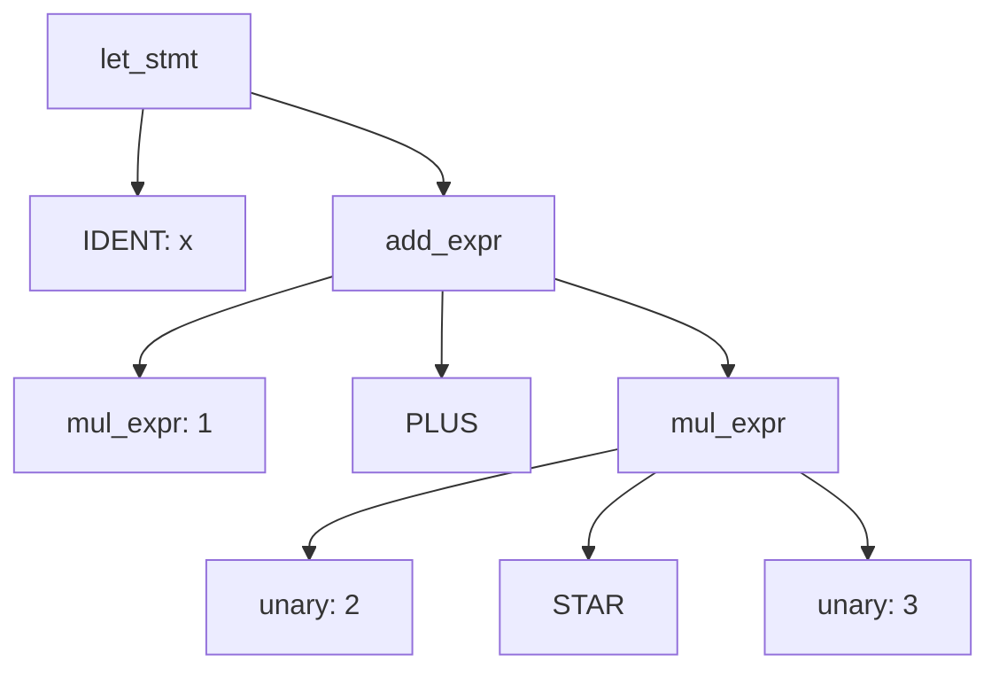

# Building the Mini Language: A Complete Guide

## Learning Goals

By the end of this tutorial, you will have:

- Designed example programs in the Mini language before writing a single line of interpreter code, establishing syntax and semantics by example
- Built a complete lexer, recursive-descent parser, and AST for the Mini language
- Implemented a tree-walking evaluator with lexical scoping, first-class functions, closures, and recursive definitions
- Added at least one extension to the baseline interpreter (e.g., lists, pattern matching, or a type checker)
- Delivered a working REPL and file-runner that can run all provided example programs

> **Tutorial Goal:** By the end of this tutorial, you will have built a fully working interpreter for the Mini programming language, complete with variables, functions, closures, recursion, and a REPL. Each phase builds directly on the previous one, so follow them in order.
>
> **Time estimate:** 8-12 hours total (all 10 phases)
>
> **Prerequisites:** Python 3.10+, familiarity with Python classes and recursion

---

## Phase 1: Design, Example Programs First

Before writing a single line of interpreter code, we need to know what our language looks like from the *outside*.  The best way to do this is to write example programs in Mini and ask: "What do I want this to mean?"  Only after we have a clear picture of the surface syntax do we design the token set and grammar.

This phase is about **language design by example**.  Every decision you make about tokens and grammar should be traceable back to a concrete program that needs to run.

### 1.1 Example Programs

**Example 1: Hello World and arithmetic**

```mini
let x = 10;
let y = 3;
let z = x * y + 1;
print z;
print "Hello, Mini!";
```

**Example 2: Fibonacci (recursive)**

```mini
fun fib(n) {
  if n <= 1 {
    return n;
  }
  return fib(n - 1) + fib(n - 2);
}
print fib(10);
```

**Example 3: Factorial (iterative with while)**

```mini
fun factorial(n) {
  let result = 1;
  let i = 1;
  while i <= n {
    result = result * i;
    i = i + 1;
  }
  return result;
}
print factorial(6);
```

**Example 4: Conditionals and booleans**

```mini
let age = 20;
let status = if age >= 18 { "adult" } else { "minor" };
print status;

if true and not false {
  print "logic works!";
}
```

**Example 5: Closures (functions returning functions)**

```mini
fun make_adder(n) {
  return fun(x) -> x + n;
}
let add5 = make_adder(5);
print add5(10);
print add5(20);
```

**Example 6: Higher-order functions**

```mini
fun apply(f, x) {
  return f(x);
}

fun square(n) {
  return n * n;
}

print apply(square, 7);

let double = fun(n) -> n * 2;
print apply(double, 8);
```

> **CTQ 1.1:** Look at Example 5.  The inner `fun(x) -> x + n` refers to `n`, which is defined in `make_adder`'s scope.  After `make_adder` returns, does `n` still exist?  What language feature makes this work?

> **CTQ 1.2:** In Example 4, `if` is used as an *expression* (its value is assigned to `status`).  What does this mean for the parser; can we use the same `if` rule for both statements and expressions?

> **CTQ 1.3:** Why does Example 3 require reassigning `result` and `i` inside the loop?  What would need to change if variables were immutable?

### 1.2 Token Table

Now that we have seen real programs, every token below has a concrete justification in the examples above.

| Token Name | Regex / Pattern                      | Example        |
|------------|--------------------------------------|----------------|
| NUMBER     | `[0-9]+(\.[0-9]+)?`                  | `42`, `3.14`   |
| STRING     | `"[^"\\]*(?:\\.[^"\\]*)*"`           | `"hello"`      |
| IDENT      | `[a-zA-Z_][a-zA-Z0-9_]*`            | `fib`, `x`     |
| PLUS       | `\+`                                 | `+`            |
| MINUS      | `-`                                  | `-`            |
| STAR       | `\*`                                 | `*`            |
| SLASH      | `/`                                  | `/`            |
| PERCENT    | `%`                                  | `%`            |
| CARET      | `\^`                                 | `^`            |
| EQ         | `==`                                 | `==`           |
| NEQ        | `!=`                                 | `!=`           |
| LT         | `<`                                  | `<`            |
| LE         | `<=`                                 | `<=`           |
| GT         | `>`                                  | `>`            |
| GE         | `>=`                                 | `>=`           |
| AND        | `and`                                | `and`          |
| OR         | `or`                                 | `or`           |
| NOT        | `not`                                | `not`          |
| ASSIGN     | `=`                                  | `x = 5`        |
| LPAREN     | `\(`                                 | `(`            |
| RPAREN     | `\)`                                 | `)`            |
| LBRACE     | `\{`                                 | `{`            |
| RBRACE     | `\}`                                 | `}`            |
| COMMA      | `,`                                  | `,`            |
| SEMI       | `;`                                  | `;`            |
| ARROW      | `->`                                 | `fun(x) -> x`  |
| IF         | `if`                                 | `if x > 0`     |
| ELSE       | `else`                               | `else { ... }` |
| WHILE      | `while`                              | `while i < n`  |
| LET        | `let`                                | `let x = 1`    |
| FUN        | `fun`                                | `fun f(x) {`   |
| RETURN     | `return`                             | `return x;`    |
| PRINT      | `print`                              | `print x;`     |
| TRUE       | `true`                               | `true`         |
| FALSE      | `false`                              | `false`        |
| NIL        | `nil`                                | `nil`          |
| EOF        | *(end of input)*                     | -              |

> **Note:** Keywords (`if`, `else`, `while`, `let`, `fun`, `return`, `print`, `true`, `false`, `nil`, `and`, `or`, `not`) are recognized by the lexer *after* reading an identifier.  A `KEYWORDS` dictionary maps keyword strings to their token kinds.

> **CTQ 1.4:** The `ARROW` token `->` and the `GT`+`MINUS` pair (`> -`) share characters.  How must the lexer prioritize these to avoid ambiguity?  (Hint: longer match wins.)

> **CTQ 1.5:** Why are `true`, `false`, and `nil` keywords rather than built-in identifiers?  What would break if they were ordinary identifiers that happened to be pre-defined in the global environment?

---

## Phase 2: Lexer

The **lexer** (also called a *scanner* or *tokenizer*) transforms raw source text into a flat list of `Token` objects.  The parser never sees individual characters; it only sees tokens.

### 2.1 Token Dataclass and Constants

```python
# lexer.py
from dataclasses import dataclass
from typing import Optional

# --- Token kind constants ---
NUMBER  = "NUMBER"
STRING  = "STRING"
IDENT   = "IDENT"
PLUS    = "PLUS"
MINUS   = "MINUS"
STAR    = "STAR"
SLASH   = "SLASH"
PERCENT = "PERCENT"
CARET   = "CARET"
EQ      = "EQ"
NEQ     = "NEQ"
LT      = "LT"
LE      = "LE"
GT      = "GT"
GE      = "GE"
AND_KW  = "AND"
OR_KW   = "OR"
NOT_KW  = "NOT"
ASSIGN  = "ASSIGN"
LPAREN  = "LPAREN"
RPAREN  = "RPAREN"
LBRACE  = "LBRACE"
RBRACE  = "RBRACE"
COMMA   = "COMMA"
SEMI    = "SEMI"
ARROW   = "ARROW"
IF      = "IF"
ELSE    = "ELSE"
WHILE   = "WHILE"
LET     = "LET"
FUN     = "FUN"
RETURN  = "RETURN"
PRINT   = "PRINT"
TRUE    = "TRUE"
FALSE   = "FALSE"
NIL     = "NIL"
EOF     = "EOF"

KEYWORDS = {
    "if":     IF,
    "else":   ELSE,
    "while":  WHILE,
    "let":    LET,
    "fun":    FUN,
    "return": RETURN,
    "print":  PRINT,
    "true":   TRUE,
    "false":  FALSE,
    "nil":    NIL,
    "and":    AND_KW,
    "or":     OR_KW,
    "not":    NOT_KW,
}

@dataclass
class Token:
    kind:  str
    value: str
    line:  int

    def __repr__(self) -> str:
        return f"Token({self.kind}, {self.value!r}, line={self.line})"
```

### 2.2 The Lexer Class

```python
# lexer.py (continued)

class LexError(Exception):
    def __init__(self, msg: str, line: int):
        super().__init__(f"[line {line}] LexError: {msg}")
        self.line = line

class Lexer:
    def __init__(self, source: str):
        self.source = source
        self.pos    = 0
        self.line   = 1

    # --- Low-level helpers ---

    def _peek(self, offset: int = 0) -> str:
        idx = self.pos + offset
        return self.source[idx] if idx < len(self.source) else ""

    def _advance(self) -> str:
        ch = self.source[self.pos]
        self.pos += 1
        if ch == "\n":
            self.line += 1
        return ch

    def _skip_whitespace_and_comments(self) -> None:
        while self.pos < len(self.source):
            ch = self._peek()
            if ch in " \t\r\n":
                self._advance()
            elif ch == "#":          # line comment: # to end of line
                while self._peek() not in ("", "\n"):
                    self._advance()
            else:
                break

    # --- Token builders ---

    def _read_number(self) -> Token:
        start = self.pos
        line  = self.line
        while self._peek().isdigit():
            self._advance()
        if self._peek() == "." and self._peek(1).isdigit():
            self._advance()          # consume "."
            while self._peek().isdigit():
                self._advance()
        return Token(NUMBER, self.source[start:self.pos], line)

    def _read_string(self) -> Token:
        line = self.line
        self._advance()              # opening "
        buf = []
        while True:
            ch = self._peek()
            if ch == "":
                raise LexError("unterminated string", line)
            if ch == '"':
                self._advance()
                break
            if ch == "\\":
                self._advance()
                esc = self._advance()
                buf.append({"n": "\n", "t": "\t",
                             "\\": "\\", '"': '"'}.get(esc, esc))
            else:
                buf.append(self._advance())
        return Token(STRING, "".join(buf), line)

    def _read_ident_or_keyword(self) -> Token:
        start = self.pos
        line  = self.line
        while self._peek().isalnum() or self._peek() == "_":
            self._advance()
        word = self.source[start:self.pos]
        kind = KEYWORDS.get(word, IDENT)
        return Token(kind, word, line)

    # --- Main tokenizer ---

    def next_token(self) -> Token:
        self._skip_whitespace_and_comments()
        line = self.line

        if self.pos >= len(self.source):
            return Token(EOF, "", line)

        ch = self._peek()

        if ch.isdigit():
            return self._read_number()
        if ch == '"':
            return self._read_string()
        if ch.isalpha() or ch == "_":
            return self._read_ident_or_keyword()

        # Two-character operators must be checked before single-char
        two = self._peek(0) + self._peek(1)
        two_map = {
            "->": ARROW, "==": EQ, "!=": NEQ,
            "<=": LE,    ">=": GE,
        }
        if two in two_map:
            self._advance(); self._advance()
            return Token(two_map[two], two, line)

        # Single-character operators
        one_map = {
            "+": PLUS,   "-": MINUS,  "*": STAR,   "/": SLASH,
            "%": PERCENT,"^": CARET,  "<": LT,     ">": GT,
            "=": ASSIGN, "(": LPAREN, ")": RPAREN, "{": LBRACE,
            "}": RBRACE, ",": COMMA,  ";": SEMI,
        }
        if ch in one_map:
            self._advance()
            return Token(one_map[ch], ch, line)

        raise LexError(f"unexpected character {ch!r}", line)

    def tokenize(self) -> list[Token]:
        tokens = []
        while True:
            tok = self.next_token()
            tokens.append(tok)
            if tok.kind == EOF:
                break
        return tokens
```

### 2.3 Try It, Tokenize a Mini Program

```python
# Run this cell to see the lexer in action.
# Combine with the lexer.py code above in one file.

source = """
fun fib(n) {
  if n <= 1 {
    return n;
  }
  return fib(n - 1) + fib(n - 2);
}
print fib(5);
"""

tokens = Lexer(source).tokenize()
for t in tokens:
    print(t)
```

Expected output (first several tokens):

```
Token(FUN, 'fun', line=2)
Token(IDENT, 'fib', line=2)
Token(LPAREN, '(', line=2)
Token(IDENT, 'n', line=2)
Token(RPAREN, ')', line=2)
Token(LBRACE, '{', line=2)
...
```

> **CTQ 2.1:** What happens if `->` is lexed as `MINUS` followed by `GT`?  Write a Mini expression where this ambiguity matters and explain which tokenization is correct.

> **CTQ 2.2:** The `_skip_whitespace_and_comments` method is called at the *start* of `next_token`.  Could you instead call it at the *end*?  What would break (or not break)?

> **CTQ 2.3:** Currently, strings support `\n`, `\t`, `\\`, and `\"` escapes.  What would you need to add to support Unicode escapes like `A`?

**Try It Exercise 2.1:** Modify the lexer to also support `//` line comments (C-style).  Which method do you change, and what is the minimal addition?

**Try It Exercise 2.2:** Add `LBRACKET` (`[`) and `RBRACKET` (`]`) tokens for list literals.  What is the minimal change needed in `next_token`?

---

## Phase 3: Grammar (EBNF)

The grammar defines the *structure* of valid programs.  We write it in Extended Backus-Naur Form (EBNF).  Our grammar must be free of left recursion (since we will build a **recursive descent** parser) and must reflect the operator precedence we want.

### 3.1 Full EBNF for Mini

```
program      = statement* EOF

statement    = let_stmt
             | fun_def
             | while_stmt
             | if_stmt
             | return_stmt
             | print_stmt
             | expr_stmt

let_stmt     = "let" IDENT "=" expr ";"
fun_def      = "fun" IDENT "(" params ")" block
while_stmt   = "while" expr block
if_stmt      = "if" expr block ( "else" block )?
return_stmt  = "return" expr ";"
print_stmt   = "print" expr ";"
expr_stmt    = expr ";"

params       = ( IDENT ( "," IDENT )* )?
block        = "{" statement* "}"

expr         = IDENT "=" expr               (* right-assoc assignment *)
             | or_expr

or_expr      = and_expr ( "or" and_expr )*
and_expr     = cmp_expr ( "and" cmp_expr )*
cmp_expr     = add_expr ( ( "==" | "!=" | "<" | "<=" | ">" | ">=" ) add_expr )?
add_expr     = mul_expr ( ( "+" | "-" ) mul_expr )*
mul_expr     = unary   ( ( "*" | "/" | "%" | "^" ) unary )*
unary        = "-" unary | "not" unary | call_expr
call_expr    = primary ( "(" args ")" )*
primary      = NUMBER | STRING | "true" | "false" | "nil"
             | IDENT
             | "(" expr ")"
             | "if" expr block ( "else" block )?
             | "fun" "(" params ")" "->" expr
             | "fun" "(" params ")" block

args         = ( expr ( "," expr )* )?
```

> **Key design decisions:**
> - `cmp_expr` allows only *one* comparison (no chaining `a < b < c`).
> - `^` is right-associative, handled carefully in the parser.
> - `fun(params) -> expr` is a **lambda** (expression body); `fun(params) { ... }` is a named function definition at statement level or an anonymous closure in expression position.
> - `if` appears as both a statement and an expression (when used inside `primary`).

### 3.2 Parse Tree Diagram

The expression `let x = 1 + 2 * 3;` parses as:



The multiplication `2 * 3` is deeper in the tree, so it evaluates first; this is how precedence emerges naturally from the grammar hierarchy.

> **CTQ 3.1:** Why does the grammar have separate `add_expr` and `mul_expr` rules instead of one `binary_expr` rule?  Trace through what would happen if you tried to combine them.

> **CTQ 3.2:** The grammar says `cmp_expr` uses `add_expr` on both sides.  What does this mean for the expression `a + b == c + d`?  Draw the parse tree.

> **CTQ 3.3:** Could you write a Mini program that is syntactically valid according to this grammar but semantically meaningless (e.g., adding a string to a boolean)?  Is that a grammar problem or a later-stage problem?

**Try It Exercise 3.1:** Add a `for` loop to the grammar: `for IDENT in expr block`.  Write the EBNF rule and identify what new tokens (if any) you need.

---

## Phase 4: AST Nodes

The **Abstract Syntax Tree** (AST) is the in-memory representation of a parsed program.  We use Python `@dataclass` for each node type, with `frozen=True` to prevent accidental mutation during evaluation.

### 4.1 Expression Nodes

```python
# ast_nodes.py
from __future__ import annotations
from dataclasses import dataclass
from typing import Optional

# Base marker classes - no fields, just for isinstance checks
class Node: pass
class Expr(Node): pass
class Stmt(Node): pass

# --- Literal expressions ---

@dataclass(frozen=True)
class Num(Expr):
    value: float

@dataclass(frozen=True)
class Str(Expr):
    value: str

@dataclass(frozen=True)
class Bool(Expr):
    value: bool

@dataclass(frozen=True)
class Nil(Expr):
    pass

# --- Composite expressions ---

@dataclass(frozen=True)
class Var(Expr):
    name: str

@dataclass(frozen=True)
class BinOp(Expr):
    op:    str   # "+", "-", "*", "/", "%", "^",
                 # "==", "!=", "<", "<=", ">", ">=", "and", "or"
    left:  Expr
    right: Expr

@dataclass(frozen=True)
class UnaryOp(Expr):
    op:      str   # "-" or "not"
    operand: Expr

@dataclass(frozen=True)
class Call(Expr):
    callee: Expr
    args:   tuple  # tuple[Expr, ...]

@dataclass(frozen=True)
class Lambda(Expr):
    params: tuple  # tuple[str, ...]
    body:   Node   # Expr for arrow form, Block for brace form

@dataclass(frozen=True)
class LetIn(Expr):
    """let x = e1 in e2  (used internally; surface syntax uses LetStmt)"""
    name:  str
    value: Expr
    body:  Expr
```

### 4.2 Statement Nodes

```python
# ast_nodes.py (continued)

@dataclass(frozen=True)
class LetStmt(Stmt):
    name:  str
    value: Expr

@dataclass(frozen=True)
class AssignStmt(Stmt):
    name:  str
    value: Expr

@dataclass(frozen=True)
class FunDef(Stmt):
    name:   str
    params: tuple   # tuple[str, ...]
    body:   "Block"

@dataclass(frozen=True)
class ReturnStmt(Stmt):
    value: Expr

@dataclass(frozen=True)
class PrintStmt(Stmt):
    value: Expr

@dataclass(frozen=True)
class IfStmt(Stmt):
    condition:   Expr
    then_branch: "Block"
    else_branch: Optional["Block"]

@dataclass(frozen=True)
class WhileStmt(Stmt):
    condition: Expr
    body:      "Block"

@dataclass(frozen=True)
class ExprStmt(Stmt):
    expr: Expr

@dataclass(frozen=True)
class Block(Node):
    stmts: tuple   # tuple[Stmt, ...]

@dataclass(frozen=True)
class Program(Node):
    stmts: tuple   # tuple[Stmt, ...]
```

### 4.3 Pretty-Printer

A `pretty_print` function lets you inspect any AST node in a readable, indented form.  This is invaluable for debugging your parser.

```python
# ast_nodes.py (continued)

def pretty_print(node: Node, indent: int = 0) -> None:
    pad = "  " * indent
    match node:
        case Program(stmts=stmts):
            print(f"{pad}Program:")
            for s in stmts: pretty_print(s, indent + 1)
        case Block(stmts=stmts):
            print(f"{pad}Block:")
            for s in stmts: pretty_print(s, indent + 1)
        case FunDef(name=n, params=p, body=b):
            print(f"{pad}FunDef {n}({', '.join(p)}):")
            pretty_print(b, indent + 1)
        case LetStmt(name=n, value=v):
            print(f"{pad}LetStmt {n} =")
            pretty_print(v, indent + 1)
        case AssignStmt(name=n, value=v):
            print(f"{pad}Assign {n} =")
            pretty_print(v, indent + 1)
        case IfStmt(condition=c, then_branch=t, else_branch=e):
            print(f"{pad}If:")
            pretty_print(c, indent + 1)
            print(f"{pad}  Then:")
            pretty_print(t, indent + 2)
            if e:
                print(f"{pad}  Else:")
                pretty_print(e, indent + 2)
        case WhileStmt(condition=c, body=b):
            print(f"{pad}While:")
            pretty_print(c, indent + 1)
            pretty_print(b, indent + 1)
        case ReturnStmt(value=v):
            print(f"{pad}Return:")
            pretty_print(v, indent + 1)
        case PrintStmt(value=v):
            print(f"{pad}Print:")
            pretty_print(v, indent + 1)
        case ExprStmt(expr=e):
            print(f"{pad}ExprStmt:")
            pretty_print(e, indent + 1)
        case BinOp(op=op, left=l, right=r):
            print(f"{pad}BinOp({op!r}):")
            pretty_print(l, indent + 1)
            pretty_print(r, indent + 1)
        case UnaryOp(op=op, operand=o):
            print(f"{pad}UnaryOp({op!r}):")
            pretty_print(o, indent + 1)
        case Call(callee=c, args=a):
            print(f"{pad}Call:")
            pretty_print(c, indent + 1)
            for arg in a: pretty_print(arg, indent + 1)
        case Lambda(params=p, body=b):
            print(f"{pad}Lambda({', '.join(p)}):")
            pretty_print(b, indent + 1)
        case Var(name=n):
            print(f"{pad}Var({n!r})")
        case Num(value=v):
            print(f"{pad}Num({v})")
        case Str(value=v):
            print(f"{pad}Str({v!r})")
        case Bool(value=v):
            print(f"{pad}Bool({v})")
        case Nil():
            print(f"{pad}Nil")
        case _:
            print(f"{pad}<unknown node: {type(node).__name__}>")
```

> **CTQ 4.1:** Why do we use `frozen=True` on AST dataclasses?  What could go wrong if AST nodes were mutable during evaluation?

> **CTQ 4.2:** The `Call` node stores `args` as a `tuple` rather than `list`.  Why does `frozen=True` require tuples instead of lists for sequence fields?

> **CTQ 4.3:** `Lambda.body` is typed as `Node` rather than `Expr` or `Stmt`.  Why is this necessary, and what are the two possible concrete types it can hold at runtime?

**Try It Exercise 4.1:** Manually construct the AST for `let x = 1 + 2;` and call `pretty_print` on it.  Does the output match your expectations?

---

## Phase 5: Parser

The **parser** consumes the flat list of tokens and builds the AST. We use **recursive descent**, where each grammar rule becomes a method.  The parser never looks at characters; it only calls token-level helpers.

### 5.1 Parser Infrastructure

```python
# parser_mini.py
from lexer import (
    Token, Lexer,
    NUMBER, STRING, IDENT, PLUS, MINUS, STAR, SLASH, PERCENT, CARET,
    EQ, NEQ, LT, LE, GT, GE, AND_KW, OR_KW, NOT_KW,
    ASSIGN, LPAREN, RPAREN, LBRACE, RBRACE, COMMA, SEMI, ARROW,
    IF, ELSE, WHILE, LET, FUN, RETURN, PRINT, TRUE, FALSE, NIL, EOF,
)
from ast_nodes import *
from typing import Optional

class ParseError(Exception):
    def __init__(self, msg: str, line: int):
        super().__init__(f"[line {line}] ParseError: {msg}")
        self.line = line

class Parser:
    def __init__(self, tokens: list):
        self.tokens = tokens
        self.pos    = 0

    # --- Infrastructure ---

    def _peek(self) -> Token:
        return self.tokens[self.pos]

    def _advance(self) -> Token:
        tok = self.tokens[self.pos]
        if tok.kind != EOF:
            self.pos += 1
        return tok

    def _expect(self, kind: str) -> Token:
        tok = self._peek()
        if tok.kind != kind:
            raise ParseError(
                f"expected {kind!r} but got {tok.kind!r} ({tok.value!r})",
                tok.line
            )
        return self._advance()

    def _match(self, *kinds: str) -> Optional[Token]:
        if self._peek().kind in kinds:
            return self._advance()
        return None
```

### 5.2 Statement Parsers

```python
    # --- Statements ---

    def parse_program(self) -> Program:
        stmts = []
        while self._peek().kind != EOF:
            stmts.append(self.parse_stmt())
        return Program(tuple(stmts))

    def parse_stmt(self) -> Stmt:
        kind = self._peek().kind
        if kind == LET:    return self.parse_let_stmt()
        if kind == FUN:    return self.parse_fun_def()
        if kind == IF:     return self.parse_if_stmt()
        if kind == WHILE:  return self.parse_while_stmt()
        if kind == RETURN: return self.parse_return_stmt()
        if kind == PRINT:  return self.parse_print_stmt()
        return self.parse_expr_stmt()

    def parse_let_stmt(self) -> LetStmt:
        self._expect(LET)
        name = self._expect(IDENT).value
        self._expect(ASSIGN)
        value = self.parse_expr()
        self._expect(SEMI)
        return LetStmt(name, value)

    def parse_fun_def(self) -> FunDef:
        self._expect(FUN)
        name = self._expect(IDENT).value
        self._expect(LPAREN)
        params = self._parse_params()
        self._expect(RPAREN)
        body = self.parse_block()
        return FunDef(name, tuple(params), body)

    def parse_if_stmt(self) -> IfStmt:
        self._expect(IF)
        cond = self.parse_expr()
        then_b = self.parse_block()
        else_b = None
        if self._match(ELSE):
            else_b = self.parse_block()
        return IfStmt(cond, then_b, else_b)

    def parse_while_stmt(self) -> WhileStmt:
        self._expect(WHILE)
        cond = self.parse_expr()
        body = self.parse_block()
        return WhileStmt(cond, body)

    def parse_return_stmt(self) -> ReturnStmt:
        self._expect(RETURN)
        value = self.parse_expr()
        self._expect(SEMI)
        return ReturnStmt(value)

    def parse_print_stmt(self) -> PrintStmt:
        self._expect(PRINT)
        value = self.parse_expr()
        self._expect(SEMI)
        return PrintStmt(value)

    def parse_expr_stmt(self) -> ExprStmt:
        expr = self.parse_expr()
        self._expect(SEMI)
        return ExprStmt(expr)

    def parse_block(self) -> Block:
        self._expect(LBRACE)
        stmts = []
        while self._peek().kind not in (RBRACE, EOF):
            stmts.append(self.parse_stmt())
        self._expect(RBRACE)
        return Block(tuple(stmts))

    def _parse_params(self) -> list:
        params = []
        if self._peek().kind == IDENT:
            params.append(self._advance().value)
            while self._match(COMMA):
                params.append(self._expect(IDENT).value)
        return params
```

### 5.3 Expression Parsers

```python
    # --- Expressions (precedence climbing via grammar hierarchy) ---

    def parse_expr(self) -> Expr:
        # Check for assignment: IDENT "=" expr  (right-associative)
        if (self._peek().kind == IDENT
                and self.pos + 1 < len(self.tokens)
                and self.tokens[self.pos + 1].kind == ASSIGN):
            name = self._advance().value
            self._advance()          # consume "="
            value = self.parse_expr()
            return AssignStmt(name, value)
        return self.parse_or()

    def parse_or(self) -> Expr:
        left = self.parse_and()
        while self._match(OR_KW):
            right = self.parse_and()
            left = BinOp("or", left, right)
        return left

    def parse_and(self) -> Expr:
        left = self.parse_comparison()
        while self._match(AND_KW):
            right = self.parse_comparison()
            left = BinOp("and", left, right)
        return left

    def parse_comparison(self) -> Expr:
        left = self.parse_additive()
        ops = {EQ: "==", NEQ: "!=", LT: "<", LE: "<=", GT: ">", GE: ">="}
        if self._peek().kind in ops:
            op_tok = self._advance()
            right = self.parse_additive()
            return BinOp(ops[op_tok.kind], left, right)
        return left

    def parse_additive(self) -> Expr:
        left = self.parse_multiplicative()
        while self._peek().kind in (PLUS, MINUS):
            op = self._advance().value
            right = self.parse_multiplicative()
            left = BinOp(op, left, right)
        return left

    def parse_multiplicative(self) -> Expr:
        left = self.parse_unary()
        while self._peek().kind in (STAR, SLASH, PERCENT, CARET):
            op_tok = self._advance()
            right = self.parse_unary()
            if op_tok.kind == CARET:
                # Right-associative: build right subtree first by recursing
                return BinOp("^", left, right)
            left = BinOp(op_tok.value, left, right)
        return left

    def parse_unary(self) -> Expr:
        if self._peek().kind == MINUS:
            self._advance()
            operand = self.parse_unary()
            return UnaryOp("-", operand)
        if self._peek().kind == NOT_KW:
            self._advance()
            operand = self.parse_unary()
            return UnaryOp("not", operand)
        return self.parse_call()

    def parse_call(self) -> Expr:
        expr = self.parse_primary()
        while self._match(LPAREN):
            args = self._parse_args()
            self._expect(RPAREN)
            expr = Call(expr, tuple(args))
        return expr

    def _parse_args(self) -> list:
        args = []
        if self._peek().kind != RPAREN:
            args.append(self.parse_expr())
            while self._match(COMMA):
                args.append(self.parse_expr())
        return args

    def parse_primary(self) -> Expr:
        tok = self._peek()

        if tok.kind == NUMBER:
            self._advance()
            v = float(tok.value)
            return Num(int(v) if v == int(v) else v)

        if tok.kind == STRING:
            self._advance()
            return Str(tok.value)

        if tok.kind == TRUE:
            self._advance(); return Bool(True)

        if tok.kind == FALSE:
            self._advance(); return Bool(False)

        if tok.kind == NIL:
            self._advance(); return Nil()

        if tok.kind == IDENT:
            self._advance(); return Var(tok.value)

        if tok.kind == LPAREN:
            self._advance()
            expr = self.parse_expr()
            self._expect(RPAREN)
            return expr

        if tok.kind == IF:
            # if used as an expression (in primary position)
            self._advance()
            cond = self.parse_expr()
            then_b = self.parse_block()
            else_b = None
            if self._match(ELSE):
                else_b = self.parse_block()
            return IfStmt(cond, then_b, else_b)

        if tok.kind == FUN:
            # Lambda: fun(params) -> expr   OR   fun(params) { block }
            self._advance()
            self._expect(LPAREN)
            params = self._parse_params()
            self._expect(RPAREN)
            if self._match(ARROW):
                body = self.parse_expr()
            else:
                body = self.parse_block()
            return Lambda(tuple(params), body)

        raise ParseError(
            f"unexpected token {tok.kind!r} ({tok.value!r})", tok.line
        )
```

### 5.4 Module-Level parse() Helper

```python
def parse(source: str) -> Program:
    tokens = Lexer(source).tokenize()
    return Parser(tokens).parse_program()
```

### 5.5 Demo, Parse the Fibonacci Function

```python
# Add this after the Parser class definition in parser_mini.py

src = """
fun fib(n) {
  if n <= 1 {
    return n;
  }
  return fib(n - 1) + fib(n - 2);
}
print fib(6);
"""
tree = parse(src)
pretty_print(tree)
```

> **CTQ 5.1:** In `parse_multiplicative`, exponentiation (`^`) is handled with a `return` instead of continuing the `while` loop.  Trace through parsing `2 ^ 3 ^ 4` to show this produces right-associativity `(2 ^ (3 ^ 4))`.

> **CTQ 5.2:** The `parse_call` method wraps `parse_primary` in a `while` loop.  Why a loop?  Give a Mini expression that requires more than one iteration of that loop.

> **CTQ 5.3:** If a user writes `let 42 = x;`, which method raises a `ParseError`, and on which token kind does it fail?

**Try It Exercise 5.1:** Add support for list literals `[1, 2, 3]` in `parse_primary`.  You will need `LBRACKET`/`RBRACKET` tokens from Try It 2.2 and a new `ListLit` AST node from Phase 4.

---

## Phase 6: Environment

The **environment** is the data structure that tracks variable bindings at runtime.  It is a linked list of *frames*, where each frame is a Python dictionary.  When a function is called, a new frame is pushed; when it returns, the frame is popped.  Crucially, closures *capture* the environment at the time they are created.

### 6.1 Environment Class

```python
# environment.py
from typing import Optional

class EnvironmentError(Exception):
    pass

class Environment:
    def __init__(self, parent: Optional["Environment"] = None):
        self._bindings: dict = {}
        self._parent   = parent

    def define(self, name: str, value: object) -> None:
        """Create a new binding in the *current* frame."""
        self._bindings[name] = value

    def lookup(self, name: str) -> object:
        """Walk the parent chain until the name is found, or raise."""
        if name in self._bindings:
            return self._bindings[name]
        if self._parent is not None:
            return self._parent.lookup(name)
        raise EnvironmentError(f"undefined variable {name!r}")

    def assign(self, name: str, value: object) -> None:
        """Update an *existing* binding, walking the parent chain."""
        if name in self._bindings:
            self._bindings[name] = value
            return
        if self._parent is not None:
            self._parent.assign(name, value)
            return
        raise EnvironmentError(f"cannot assign to undefined variable {name!r}")

    def child(self) -> "Environment":
        """Return a new child frame whose parent is self."""
        return Environment(parent=self)

    def __repr__(self) -> str:
        frames = []
        env = self
        while env is not None:
            frames.append(list(env._bindings.keys()))
            env = env._parent
        return f"Environment(frames={frames})"
```

### 6.2 Three-Frame Example

```python
# Demonstrate nested environments - run this standalone

from environment import Environment

# Global frame
global_env = Environment()
global_env.define("x", 10)
global_env.define("y", 20)

# Function call frame (child of global)
func_env = global_env.child()
func_env.define("a", 1)
func_env.define("b", 2)

# Inner let frame (child of function)
inner_env = func_env.child()
inner_env.define("temp", 99)

# Lookup walks the chain upward
print(inner_env.lookup("temp"))  # 99  - found in inner_env
print(inner_env.lookup("a"))     # 1   - found in func_env
print(inner_env.lookup("x"))     # 10  - found in global_env

# Assign walks the chain and mutates the correct frame
inner_env.assign("a", 42)
print(func_env.lookup("a"))      # 42  - updated in func_env

# Define creates in the *current* frame, even if same name exists above
inner_env.define("x", 999)
print(inner_env.lookup("x"))     # 999 - shadows global x
print(global_env.lookup("x"))    # 10  - global unchanged
```

> **CTQ 6.1:** What is the difference between `define` and `assign`?  Give a Mini code example where using one instead of the other would produce the wrong behavior.

> **CTQ 6.2:** When a closure is created, it captures the *current* environment object by reference (not by copy).  What does this mean for the following Mini program?
> ```mini
> let counter = 0;
> fun inc() { counter = counter + 1; }
> inc(); inc(); inc();
> print counter;   # What does this print?
> ```

> **CTQ 6.3:** Could you implement environments using a single flat dictionary augmented with integer scope IDs?  What would be harder about that approach?

---

## Phase 7: Evaluator

The **evaluator** (interpreter) walks the AST and produces values.  It is the heart of the language.  We use Python's `match` statement for clean dispatch on AST node types.

### 7.1 Runtime Values

```python
# interpreter.py
from __future__ import annotations
from dataclasses import dataclass
from typing import Callable, Optional, Any
from ast_nodes import *
from environment import Environment, EnvironmentError

# --- Runtime value types ---

@dataclass
class Closure:
    params: list
    body:   Node
    env:    Environment   # the captured environment

    def __repr__(self) -> str:
        return f"<closure({', '.join(self.params)})>"

@dataclass
class BuiltinFn:
    name: str
    fn:   Callable

    def __repr__(self) -> str:
        return f"<builtin:{self.name}>"

class ReturnSignal(Exception):
    """Non-error exception used to unwind the call stack for `return`."""
    def __init__(self, value: Any):
        self.value = value

class RuntimeError_(Exception):
    def __init__(self, msg: str):
        super().__init__(f"RuntimeError: {msg}")
```

### 7.2 Interpreter Class

```python
# interpreter.py (continued)

class Interpreter:
    def __init__(self, global_env: Optional[Environment] = None):
        self.global_env = global_env or Environment()

    def eval(self, node: Node, env: Environment) -> Any:
        match node:
            # --- Literals ---
            case Num(value=v):      return v
            case Str(value=v):      return v
            case Bool(value=v):     return v
            case Nil():             return None

            # --- Variable lookup ---
            case Var(name=n):
                try:
                    return env.lookup(n)
                except EnvironmentError as e:
                    raise RuntimeError_(str(e))

            # --- Binary operators ---
            case BinOp(op=op, left=l, right=r):
                return self._eval_binop(op, l, r, env)

            # --- Unary operators ---
            case UnaryOp(op="-", operand=o):
                v = self.eval(o, env)
                if not isinstance(v, (int, float)):
                    raise RuntimeError_(
                        f"unary minus requires a number, got {type(v).__name__}"
                    )
                return -v
            case UnaryOp(op="not", operand=o):
                return not self._truthy(self.eval(o, env))

            # --- Function call ---
            case Call(callee=callee, args=args):
                fn   = self.eval(callee, env)
                vals = [self.eval(a, env) for a in args]
                return self._apply(fn, vals)

            # --- Lambda creates a closure ---
            case Lambda(params=params, body=body):
                return Closure(list(params), body, env)

            # --- Let-in expression (internal) ---
            case LetIn(name=n, value=v_node, body=body):
                child = env.child()
                child.define(n, self.eval(v_node, env))
                return self.eval(body, child)

            # --- if-expression (if used as an expression in primary position) ---
            case IfStmt(condition=cond, then_branch=then_b, else_branch=else_b):
                if self._truthy(self.eval(cond, env)):
                    return self._eval_block(then_b, env)
                elif else_b is not None:
                    return self._eval_block(else_b, env)
                return None

            # --- Statements ---
            case LetStmt(name=n, value=v_node):
                env.define(n, self.eval(v_node, env))
                return None

            case AssignStmt(name=n, value=v_node):
                try:
                    env.assign(n, self.eval(v_node, env))
                except EnvironmentError as e:
                    raise RuntimeError_(str(e))
                return None

            case FunDef(name=n, params=params, body=body):
                closure = Closure(list(params), body, env)
                env.define(n, closure)
                return None

            case ReturnStmt(value=v_node):
                raise ReturnSignal(self.eval(v_node, env))

            case PrintStmt(value=v_node):
                print(self._to_str(self.eval(v_node, env)))
                return None

            case WhileStmt(condition=cond, body=body):
                while self._truthy(self.eval(cond, env)):
                    self._eval_block(body, env)
                return None

            case ExprStmt(expr=e):
                return self.eval(e, env)

            case Block():
                return self._eval_block(node, env)

            case Program(stmts=stmts):
                result = None
                for s in stmts:
                    result = self.eval(s, self.global_env)
                return result

            case _:
                raise RuntimeError_(
                    f"unknown node type: {type(node).__name__}"
                )

    def _eval_block(self, block: Block, parent_env: Environment) -> Any:
        child = parent_env.child()
        result = None
        for stmt in block.stmts:
            result = self.eval(stmt, child)
        return result

    def _truthy(self, v: Any) -> bool:
        if v is None or v is False:
            return False
        if v == 0 or v == 0.0:
            return False
        return True

    def _to_str(self, v: Any) -> str:
        if v is None:    return "nil"
        if v is True:    return "true"
        if v is False:   return "false"
        if isinstance(v, float) and v == int(v):
            return str(int(v))
        return str(v)

    def _eval_binop(self, op: str, l_node: Expr, r_node: Expr,
                    env: Environment) -> Any:
        # Short-circuit operators evaluated lazily
        if op == "and":
            lv = self.eval(l_node, env)
            return lv if not self._truthy(lv) else self.eval(r_node, env)
        if op == "or":
            lv = self.eval(l_node, env)
            return lv if self._truthy(lv) else self.eval(r_node, env)

        # Eager evaluation for all other operators
        lv = self.eval(l_node, env)
        rv = self.eval(r_node, env)

        match op:
            case "+":
                if isinstance(lv, str) or isinstance(rv, str):
                    return self._to_str(lv) + self._to_str(rv)
                return lv + rv
            case "-":  return lv - rv
            case "*":  return lv * rv
            case "/":
                if rv == 0: raise RuntimeError_("division by zero")
                return lv / rv
            case "%":
                if rv == 0: raise RuntimeError_("modulo by zero")
                return lv % rv
            case "^":  return lv ** rv
            case "==": return lv == rv
            case "!=": return lv != rv
            case "<":  return lv < rv
            case "<=": return lv <= rv
            case ">":  return lv > rv
            case ">=": return lv >= rv
            case _:    raise RuntimeError_(f"unknown operator {op!r}")

    def _apply(self, fn: Any, args: list) -> Any:
        if isinstance(fn, BuiltinFn):
            return fn.fn(*args)
        if isinstance(fn, Closure):
            if len(args) != len(fn.params):
                raise RuntimeError_(
                    f"expected {len(fn.params)} args but got {len(args)}"
                )
            call_env = fn.env.child()
            for param, val in zip(fn.params, args):
                call_env.define(param, val)
            try:
                return self._eval_block_or_expr(fn.body, call_env)
            except ReturnSignal as ret:
                return ret.value
        raise RuntimeError_(f"cannot call {self._to_str(fn)!r}")

    def _eval_block_or_expr(self, body: Node, env: Environment) -> Any:
        if isinstance(body, Block):
            child = env.child()
            result = None
            for stmt in body.stmts:
                result = self.eval(stmt, child)
            return result
        else:
            return self.eval(body, env)
```

### 7.3 Fibonacci Step-by-Step

```python
# Full pipeline: lex -> parse -> evaluate fib(10)
# Combine all prior modules (lexer.py, ast_nodes.py, environment.py,
# parser_mini.py, interpreter.py) into one directory, then run this.

from lexer import Lexer
from parser_mini import parse
from interpreter import Interpreter
from environment import Environment

source = """
fun fib(n) {
  if n <= 1 {
    return n;
  }
  return fib(n - 1) + fib(n - 2);
}
print fib(10);
"""

interp = Interpreter()
tree   = parse(source)
interp.eval(tree, interp.global_env)
# Expected output: 55
```

> **CTQ 7.1:** The `_apply` method creates a new child environment `fn.env.child()` rather than `env.child()`.  Why is `fn.env` the right parent?  What language behavior depends on this choice?

> **CTQ 7.2:** `ReturnSignal` is a Python exception rather than a special return value from `eval`.  Why use an exception for this?  What would be harder about returning a `(value, did_return)` tuple from every `eval` call instead?

> **CTQ 7.3:** In `_eval_binop`, the `+` case checks for strings first and concatenates.  What does `1 + "hello"` produce in Mini?  Is this intentional?  How would you change it to raise a type error instead?

**Try It Exercise 7.1:** Verify that `^` is right-associative end-to-end: evaluate `2 ^ 3 ^ 2` and confirm it equals `512` (= `2 ^ 9`), not `64` (= `8 ^ 2`).

**Try It Exercise 7.2:** Implement a `make_counter` closure in Mini:

```mini
fun make_counter() {
  let n = 0;
  return fun() -> n + 1;
}
```
Does the inner function mutate `n`?  Why or why not?  What would you need to add to make the counter actually increment?

---

## Phase 8: REPL and File Runner

A REPL (Read-Eval-Print Loop) lets users type Mini expressions interactively.  The file runner executes `.mini` files.  Both share the same `run_source` core function, which keeps error handling consistent.

### 8.1 run_source

```python
# runner.py
import sys
from lexer import Lexer, LexError
from parser_mini import Parser, ParseError
from interpreter import Interpreter, RuntimeError_
from environment import Environment
from ast_nodes import Program

def run_source(source: str, interp: Interpreter) -> object:
    """
    Lex, parse, and evaluate source in the context of `interp`.
    Returns the final evaluated value (useful for REPL display).
    Propagates LexError, ParseError, or RuntimeError_ on failure.
    """
    # Stage 1: Lex
    tokens = Lexer(source).tokenize()   # raises LexError on bad input

    # Stage 2: Parse
    parser = Parser(tokens)
    tree   = parser.parse_program()     # raises ParseError on bad structure

    # Stage 3: Evaluate
    return interp.eval(tree, interp.global_env)  # raises RuntimeError_ at runtime
```

### 8.2 REPL

```python
# runner.py (continued)

def repl(interp: Interpreter) -> None:
    print("Mini REPL  (type 'exit' to quit)")
    while True:
        try:
            line = input(">>> ")
        except (EOFError, KeyboardInterrupt):
            print()
            break

        line = line.strip()
        if not line:
            continue
        if line == "exit":
            break

        # Allow multi-line input: keep reading until braces balance
        source       = line
        open_braces  = source.count("{") - source.count("}")
        while open_braces > 0:
            try:
                more = input("... ")
            except (EOFError, KeyboardInterrupt):
                break
            source      += "\n" + more
            open_braces += more.count("{") - more.count("}")

        try:
            result = run_source(source, interp)
            if result is not None:
                print(f"=> {interp._to_str(result)}")
        except (LexError, ParseError, RuntimeError_) as e:
            print(f"Error: {e}", file=sys.stderr)
        except Exception as e:
            print(f"Unexpected error: {e}", file=sys.stderr)
```

### 8.3 File Runner and main()

```python
# runner.py (continued)

import argparse

def run_file(path: str, interp: Interpreter) -> None:
    try:
        with open(path) as f:
            source = f.read()
    except FileNotFoundError:
        print(f"Error: file not found: {path!r}", file=sys.stderr)
        sys.exit(1)

    try:
        run_source(source, interp)
    except (LexError, ParseError, RuntimeError_) as e:
        print(f"Error: {e}", file=sys.stderr)
        sys.exit(1)

def main() -> None:
    from builtins_mini import make_global_env
    global_env = make_global_env()
    interp     = Interpreter(global_env)

    ap = argparse.ArgumentParser(description="Mini language interpreter")
    ap.add_argument("--file", "-f", metavar="PATH",
                    help="run a .mini source file")
    args = ap.parse_args()

    if args.file:
        run_file(args.file, interp)
    else:
        repl(interp)

if __name__ == "__main__":
    main()
```

### 8.4 Sample REPL Session

> ```
> Mini REPL  (type 'exit' to quit)
> >>> let x = 10;
> >>> let y = 20;
> >>> print x + y;
> 30
> >>> fun square(n) {
> ...   return n * n;
> ... }
> >>> print square(7);
> 49
> >>> let f = fun(x) -> x * 2;
> >>> print f(21);
> 42
> >>> print 1 / 0;
> Error: [line 1] RuntimeError: division by zero
> >>> exit
> ```

> **CTQ 8.1:** The REPL reads until braces balance.  What happens if a user types an unbalanced `{` and never closes it?  How would you add a maximum-lines limit to guard against this?

> **CTQ 8.2:** `run_source` re-raises all errors rather than printing them internally.  What is the advantage of re-raising instead of printing?  How does this make `run_source` more reusable?

> **CTQ 8.3:** When running with `--file`, should the interpreter share state across multiple `run_file` calls?  What would need to change to support passing multiple files on the command line and having them share a global environment?

**Try It Exercise 8.1:** Add a `--debug` flag that calls `pretty_print(tree)` after parsing but before evaluating when running from a file.  This is extremely useful for tracking down parser bugs.

---

## Phase 9: Built-in Functions

Built-in functions expose Python capabilities to Mini code.  They are registered in the global environment as `BuiltinFn` objects before any user code runs, so they are available from the first line of every program.

### 9.1 make_global_env()

```python
# builtins_mini.py
import math
from environment import Environment
from interpreter import BuiltinFn, RuntimeError_

def make_global_env() -> Environment:
    env = Environment()

    # --- Type conversions ---
    env.define("int",   BuiltinFn("int",   lambda x: int(float(x))))
    env.define("float", BuiltinFn("float", lambda x: float(x)))
    env.define("str",   BuiltinFn("str",   lambda x: str(x)))
    env.define("bool",  BuiltinFn("bool",  lambda x: bool(x)))

    # --- I/O ---
    env.define("input",   BuiltinFn("input",   lambda prompt="": input(str(prompt))))
    env.define("println", BuiltinFn("println", lambda x="": print(x)))

    # --- String / list length ---
    def _len(x):
        if isinstance(x, (str, list)):
            return len(x)
        raise RuntimeError_(f"len() requires string or list, got {type(x).__name__}")
    env.define("len", BuiltinFn("len", _len))

    # --- Range ---
    def _range(*args):
        if len(args) == 1:
            return list(range(int(args[0])))
        elif len(args) == 2:
            return list(range(int(args[0]), int(args[1])))
        raise RuntimeError_("range() takes 1 or 2 arguments")
    env.define("range", BuiltinFn("range", _range))

    # --- Higher-order functions ---
    # These need access to _apply, so we build a shared helper:
    def _make_apply():
        """Lazy import to avoid circular dependency."""
        from interpreter import Interpreter
        _interp = Interpreter(env)
        return _interp._apply

    def _map(f, lst):
        apply = _make_apply()
        return [apply(f, [x]) for x in lst]

    def _filter(f, lst):
        from interpreter import Interpreter
        _interp = Interpreter(env)
        return [x for x in lst
                if _interp._truthy(_interp._apply(f, [x]))]

    def _reduce(f, init, lst):
        apply = _make_apply()
        acc = init
        for x in lst:
            acc = apply(f, [acc, x])
        return acc

    env.define("map",    BuiltinFn("map",    _map))
    env.define("filter", BuiltinFn("filter", _filter))
    env.define("reduce", BuiltinFn("reduce", _reduce))

    # --- List operations ---
    env.define("append", BuiltinFn("append", lambda lst, x: lst + [x]))
    env.define("head",   BuiltinFn("head",
        lambda lst: lst[0] if lst else (_ for _ in ()).throw(
            RuntimeError_("head() called on empty list"))))
    env.define("tail",   BuiltinFn("tail",   lambda lst: lst[1:] if lst else []))
    env.define("cons",   BuiltinFn("cons",   lambda x, lst: [x] + lst))
    env.define("empty",  BuiltinFn("empty",  lambda lst: len(lst) == 0))

    # --- Math ---
    env.define("sqrt",  BuiltinFn("sqrt",  math.sqrt))
    env.define("floor", BuiltinFn("floor", math.floor))
    env.define("ceil",  BuiltinFn("ceil",  math.ceil))
    env.define("abs",   BuiltinFn("abs",   abs))
    env.define("max",   BuiltinFn("max",   lambda a, b: a if a > b else b))
    env.define("min",   BuiltinFn("min",   lambda a, b: a if a < b else b))

    return env
```

### 9.2 Using map and filter in Mini

```mini
# squares_and_evens.mini

let nums    = range(10);
let squares = map(fun(n) -> n * n, nums);
let evens   = filter(fun(n) -> n % 2 == 0, squares);
print evens;
# Output: [0, 4, 16, 36, 64]

# Sum using reduce
let total = reduce(fun(acc, x) -> acc + x, 0, range(1, 6));
print total;
# Output: 15  (= 1 + 2 + 3 + 4 + 5)
```

### 9.3 Calling Built-ins from the REPL

```python
# Verify the full pipeline with built-ins

from builtins_mini import make_global_env
from interpreter import Interpreter
from runner import run_source

interp = Interpreter(make_global_env())

run_source('print map(fun(x) -> x * x, range(5));', interp)
# Output: [0, 1, 4, 9, 16]

run_source('print reduce(fun(a, b) -> a + b, 0, range(1, 11));', interp)
# Output: 55
```

> **CTQ 9.1:** The `_map` helper creates a new `Interpreter(env)` on every call.  This is wasteful.  What is the cleanest architectural way to give built-ins access to the running interpreter's `_apply` method without creating new instances?

> **CTQ 9.2:** `append` is defined as `lambda lst, x: lst + [x]`, which returns a *new* list.  Is this consistent with Mini's overall value semantics (mutability vs. immutability)?  What would change if lists were mutable?

> **CTQ 9.3:** `head([])` as currently written would crash with a Python error rather than raising a `RuntimeError_`.  Fix the `head` definition so it raises a proper Mini runtime error.

**Try It Exercise 9.1:** Write a Mini program that uses `cons`, `head`, and `tail` to implement a recursive `my_sum` function, without using `reduce` or any Python built-ins.

**Try It Exercise 9.2:** Add a `type_of(x)` built-in that returns a string: `"number"`, `"string"`, `"bool"`, `"nil"`, `"list"`, or `"function"`.  This is invaluable for debugging Mini programs.

---

## Phase 10: Testing and Debugging Checklist

With all phases complete, this final phase gives you a systematic way to verify correctness and find subtle bugs before submitting.

### 10.1 Checklist of 10 Things to Verify

1.  **Lexical scoping**: Inner functions see outer-scope variables; sibling functions do not share locals.
2.  **Closures capture by reference**: A returned closure correctly reflects mutations to captured variables.
3.  **Recursion correctness**: `fib(10)` returns `55`; `factorial(6)` returns `720`.
4.  **Tail recursion pitfall**: Mini does *not* optimize tail calls (Python doesn't either).  For `fib(40)`, Python will hit its default recursion limit.  Document this limitation clearly in your README.
5.  **Mutual recursion with forward references**: Two functions that call each other both work correctly when both definitions precede any calls.
6.  **String escapes**: `"\n"`, `"\t"`, `"\\"`, and `"\""` produce the correct Python characters.
7.  **Division by zero**: `1 / 0` raises a `RuntimeError_` with a clear message, not an uncaught Python `ZeroDivisionError`.
8.  **Type errors**: `"hello" - 1` raises a `RuntimeError_`, not an uncaught Python `TypeError`.
9.  **Early return from nested loops**: A `return` inside a `while` inside a `fun` exits the entire function, not just the loop body.
10.  **Built-ins are first-class values**: `map` can be passed as an argument: `let m = map; print m(fun(x) -> x+1, range(3));` works.

### 10.2 Complete Test Suite

```python
# test_mini.py
import unittest
import io, sys

from lexer import (Lexer, Token, LexError,
                   NUMBER, STRING, IDENT, EOF,
                   IF, ELSE, WHILE, LET, FUN, RETURN, PRINT,
                   TRUE, FALSE, NIL, AND_KW, OR_KW, NOT_KW,
                   PLUS, MINUS, STAR, SLASH, PERCENT, CARET,
                   EQ, NEQ, LE, GE, LT, GT, ARROW, ASSIGN)
from parser_mini import Parser, ParseError, parse
from ast_nodes import (LetStmt, FunDef, IfStmt, WhileStmt, ExprStmt,
                       BinOp, Call, Block, Program, Num, Var)
from interpreter import Interpreter, RuntimeError_
from builtins_mini import make_global_env
from runner import run_source


# ---------------------------------------------------------------------------
# TestLexer
# ---------------------------------------------------------------------------

class TestLexer(unittest.TestCase):

    def _lex(self, source):
        return Lexer(source).tokenize()

    def test_numbers(self):
        toks = self._lex("42 3.14 0")
        self.assertEqual(toks[0].kind, NUMBER)
        self.assertEqual(toks[0].value, "42")
        self.assertEqual(toks[1].kind, NUMBER)
        self.assertEqual(toks[1].value, "3.14")
        self.assertEqual(toks[2].kind, NUMBER)
        self.assertEqual(toks[2].value, "0")

    def test_strings(self):
        toks = self._lex('"hello" "world\\n"')
        self.assertEqual(toks[0].kind, STRING)
        self.assertEqual(toks[0].value, "hello")
        self.assertEqual(toks[1].kind, STRING)
        self.assertEqual(toks[1].value, "world\n")

    def test_keywords(self):
        toks = self._lex("if else while let fun return print true false nil")
        kinds = [t.kind for t in toks if t.kind != EOF]
        self.assertEqual(
            kinds,
            [IF, ELSE, WHILE, LET, FUN, RETURN, PRINT, TRUE, FALSE, NIL]
        )

    def test_operators(self):
        toks = self._lex("+ - * / % ^ == != <= >= < > -> =")
        expected = [PLUS, MINUS, STAR, SLASH, PERCENT, CARET,
                    EQ, NEQ, LE, GE, LT, GT, ARROW, ASSIGN]
        kinds = [t.kind for t in toks if t.kind != EOF]
        self.assertEqual(kinds, expected)

    def test_lex_error(self):
        with self.assertRaises(LexError):
            Lexer("@").tokenize()


# ---------------------------------------------------------------------------
# TestParser
# ---------------------------------------------------------------------------

class TestParser(unittest.TestCase):

    def _parse(self, source):
        return parse(source)

    def test_expression_precedence(self):
        tree = self._parse("let x = 1 + 2 * 3;")
        stmt = tree.stmts[0]
        self.assertIsInstance(stmt, LetStmt)
        self.assertIsInstance(stmt.value, BinOp)
        self.assertEqual(stmt.value.op, "+")
        self.assertIsInstance(stmt.value.right, BinOp)
        self.assertEqual(stmt.value.right.op, "*")

    def test_if_stmt(self):
        tree = self._parse("if x > 0 { print x; }")
        stmt = tree.stmts[0]
        self.assertIsInstance(stmt, IfStmt)
        self.assertIsInstance(stmt.condition, BinOp)
        self.assertEqual(stmt.condition.op, ">")
        self.assertIsNone(stmt.else_branch)

    def test_while_stmt(self):
        tree = self._parse("while i < 10 { i = i + 1; }")
        stmt = tree.stmts[0]
        self.assertIsInstance(stmt, WhileStmt)
        self.assertIsInstance(stmt.body, Block)

    def test_fun_def(self):
        tree = self._parse("fun add(a, b) { return a + b; }")
        stmt = tree.stmts[0]
        self.assertIsInstance(stmt, FunDef)
        self.assertEqual(stmt.name, "add")
        self.assertEqual(stmt.params, ("a", "b"))

    def test_nested_calls(self):
        tree = self._parse("f(g(x, y), 1);")
        stmt = tree.stmts[0]
        self.assertIsInstance(stmt, ExprStmt)
        call = stmt.expr
        self.assertIsInstance(call, Call)
        self.assertIsInstance(call.args[0], Call)


# ---------------------------------------------------------------------------
# TestInterpreter
# ---------------------------------------------------------------------------

class TestInterpreter(unittest.TestCase):

    def _make_interp(self):
        return Interpreter(make_global_env())

    def _run(self, source):
        """Run source and return captured stdout as a stripped string."""
        interp = self._make_interp()
        buf = io.StringIO()
        old_stdout, sys.stdout = sys.stdout, buf
        try:
            run_source(source, interp)
        finally:
            sys.stdout = old_stdout
        return buf.getvalue().strip()

    def _eval_last(self, source):
        """Evaluate source and return the interpreter's last value."""
        interp = self._make_interp()
        return run_source(source, interp)

    def test_fibonacci_10(self):
        output = self._run("""
            fun fib(n) {
              if n <= 1 { return n; }
              return fib(n - 1) + fib(n - 2);
            }
            print fib(10);
        """)
        self.assertEqual(output, "55")

    def test_factorial_iterative(self):
        output = self._run("""
            fun fact(n) {
              let r = 1;
              let i = 1;
              while i <= n { r = r * i; i = i + 1; }
              return r;
            }
            print fact(6);
        """)
        self.assertEqual(output, "720")

    def test_closure_counter(self):
        output = self._run("""
            let count = 0;
            fun inc() { count = count + 1; }
            inc(); inc(); inc();
            print count;
        """)
        self.assertEqual(output, "3")

    def test_closure_make_adder(self):
        output = self._run("""
            fun make_adder(n) { return fun(x) -> x + n; }
            let add5 = make_adder(5);
            print add5(10);
        """)
        self.assertEqual(output, "15")

    def test_higher_order_map(self):
        output = self._run("""
            let result = map(fun(x) -> x * x, range(5));
            print len(result);
        """)
        self.assertEqual(output, "5")

    def test_string_concat(self):
        output = self._run('print "hello" + " " + "world";')
        self.assertEqual(output, "hello world")

    def test_division_by_zero(self):
        with self.assertRaises(RuntimeError_):
            self._eval_last("let x = 1 / 0;")

    def test_early_return_from_nested_while(self):
        output = self._run("""
            fun find_first(limit, target) {
              let i = 0;
              while i < limit {
                if i == target { return i; }
                i = i + 1;
              }
              return -1;
            }
            print find_first(100, 42);
        """)
        self.assertEqual(output, "42")


# ---------------------------------------------------------------------------
# Run
# ---------------------------------------------------------------------------

if __name__ == "__main__":
    unittest.main(verbosity=2)
```

### 10.3 Running the Tests

```
# From the project directory:
python -m pytest test_mini.py -v

# Or directly:
python test_mini.py

# Expected output (all passing):
# test_lex_error ........... ok
# test_keywords ............ ok
# test_numbers ............. ok
# test_operators ........... ok
# test_strings ............. ok
# test_closure_counter ..... ok
# test_closure_make_adder .. ok
# test_division_by_zero .... ok
# test_early_return_from_nested_while ... ok
# test_expression_precedence ......... ok
# test_factorial_iterative ........... ok
# test_fibonacci_10 .................. ok
# test_fun_def ....................... ok
# test_higher_order_map .............. ok
# test_if_stmt ....................... ok
# test_nested_calls .................. ok
# test_string_concat ................. ok
# test_while_stmt .................... ok
# Ran 18 tests in ~0.3s
# OK
```

### 10.4 What's Next

You now have a complete working interpreter for Mini.  The following extensions are described in the **Extensions Menu** of the [Team Language Project](https://www.billmongan.com/Ursinus-CS374-Fall2026/Projects/TeamLanguage) and build directly on this foundation:

**Language features to add:**
- **List indexing**: `lst[i]` read and `lst[i] = v` write; requires new AST nodes `IndexExpr` and `IndexAssign`, plus updates to the parser's `parse_call` and the evaluator.
- **String slicing**: `s[i:j]`; a natural extension of list indexing.
- **Pattern matching**: Add a `match expr { case pattern: block ... }` construct to the grammar and evaluator.
- **Tail-call optimization**: Convert the interpreter to a trampoline-style loop to avoid Python stack overflow on deeply recursive Mini programs.
- **Module system**: Add an `import "file.mini"` statement to split programs across multiple files.

**Compiler backends:**
- **Bytecode compiler + stack VM**: Compile the AST to a custom instruction set and build a virtual machine to execute it.  Dramatically faster than tree-walking.
- **Python transpiler**: Walk the AST and emit Python source code instead of interpreting.  Allows Mini programs to be packaged as `.py` files.
- **Static type checker**: Add a Hindley-Milner type inference pass that runs before evaluation to catch type errors at compile time.

**Tooling:**
- **Source formatter**: Walk the AST and emit normalized, consistently indented Mini source (an "unparser").
- **Interactive debugger**: Add a `breakpoint;` statement that drops into a mini-REPL inside the running program.
- **Language Server Protocol (LSP) server**: Expose go-to-definition, hover documentation, and diagnostics to editors like VS Code.

> **CTQ 10.1:** The `test_early_return_from_nested_while` test validates that `return` inside a `while` exits the entire function.  Trace through the Python call stack to explain exactly how `ReturnSignal` achieves this, specifically, what happens when `raise ReturnSignal(...)` is executed inside `_eval_block`, called from `eval(WhileStmt, ...)`, called from `_eval_block_or_expr`, called from `_apply`.

> **CTQ 10.2:** The test suite uses `io.StringIO` to capture `print` output.  Is this a good testing strategy?  What would be a cleaner approach that does not depend on stdout redirection?

> **CTQ 10.3:** `test_fibonacci_10` calls `fib(10)`.  Why not `fib(35)` or `fib(40)`?  What would you need to add to Mini to make large Fibonacci computations practical without hitting Python's recursion limit?

---

*End of Tutorial, Building the Mini Language: A Complete Guide*

# From the Language Design Studio: Grammar v0 Starter

The feature-checklist and EBNF-skeleton builder below came from the Sprint 0 class session.  It is a tool you run while drafting your grammar, so it lives with the project guide.

## Model 2: Grammar v0 Starter - Feature Checklist

The cell below walks through a feature checklist and emits a starter grammar in EBNF. Your team modifies it; the point is to make sure no feature is forgotten.

```python
# Grammar v0 feature checklist + EBNF skeleton generator.
# Edit the feature flags to match your team's decisions, then run.

# -- Feature flags -------------------------------------------------------------
FEATURES = {
    # Core (required)
    "variables":        True,   # let x = expr
    "arithmetic":       True,   # + - * / with precedence
    "booleans":         True,   # true, false, and/or/not
    "comparisons":      True,   # < <= > >= == !=
    "short_circuit":    True,   # and/or lazy
    "selection":        True,   # if/else
    "iteration":        True,   # while loop
    "strings":          True,   # "hello" string type

    # Optional (mark True if your team is adding them)
    "functions":        True,   # fun f(x) { ... }
    "return":           True,   # return expr
    "for_loop":         False,  # for x in list { ... }
    "lists":            False,  # [1, 2, 3]
    "dicts":            False,  # {key: value}
    "closures":         False,  # functions capturing outer vars
    "classes":          False,  # class Foo { ... }
    "pattern_match":    False,  # match expr { ... }
    "niche_feature":    True,   # YOUR DISTINCTIVE FEATURE (name it below!)

    # Niche feature name and description (edit these):
    "_niche_name":      "dice_roll",       # e.g., "dice_roll", "turtle_move"
    "_niche_desc":      "3d6 -> roll 3 six-sided dice and sum",
}

# -- EBNF skeleton builder -----------------------------------------------------

def emit_grammar(f):
    lines = [
        "program   ::= statement* EOF",
        "",
        "statement ::= let_stmt",
        "            | if_stmt",
    ]
    if f["iteration"]:
        lines.append("            | while_stmt")
    if f["for_loop"]:
        lines.append("            | for_stmt")
    if f["functions"]:
        lines.append("            | fun_decl")
    if f["return"]:
        lines.append("            | return_stmt")
    if f["classes"]:
        lines.append("            | class_decl")
    if f["niche_feature"]:
        lines.append(f"            | {f['_niche_name']}_stmt")
    lines.append("            | expr_stmt")
    lines.append("")

    lines.append("let_stmt  ::= 'let' IDENT '=' expr ';'")
    lines.append("if_stmt   ::= 'if' '(' expr ')' block ( 'else' block )?")
    if f["iteration"]:
        lines.append("while_stmt ::= 'while' '(' expr ')' block")
    if f["for_loop"]:
        lines.append("for_stmt  ::= 'for' IDENT 'in' expr block")
    if f["functions"]:
        lines.append("fun_decl  ::= 'fun' IDENT '(' params ')' block")
        lines.append("params    ::= ( IDENT ( ',' IDENT )* )?")
    if f["return"]:
        lines.append("return_stmt ::= 'return' expr? ';'")
    if f["niche_feature"]:
        lines.append(f"  (* {f['_niche_name']}: {f['_niche_desc']} *)")
    lines.append("expr_stmt ::= expr ';'")
    lines.append("block     ::= '{' statement* '}'")
    lines.append("")

    # Expression ladder (precedence, lowest to highest)
    lines.append("(* Expression ladder; lower rules bind more loosely *)")
    lines.append("expr      ::= or_expr")
    if f["short_circuit"]:
        lines.append("or_expr   ::= and_expr ( 'or' and_expr )*")
        lines.append("and_expr  ::= not_expr ( 'and' not_expr )*")
        lines.append("not_expr  ::= 'not' not_expr | compare")
    if f["comparisons"]:
        lines.append("compare   ::= add_expr ( ( '<' | '<=' | '>' | '>=' | '==' | '!=' ) add_expr )?")
    lines.append("add_expr  ::= mul_expr ( ( '+' | '-' ) mul_expr )*")
    lines.append("mul_expr  ::= unary   ( ( '*' | '/' ) unary   )*")
    lines.append("unary     ::= '-' unary | primary")
    lines.append("")

    # Primary forms
    primaries = ["NUMBER", "STRING", "IDENT", "'(' expr ')'"]
    if f["booleans"]:
        primaries = ["'true'", "'false'"] + primaries
    if f["lists"]:
        primaries.append("'[' ( expr ( ',' expr )* )? ']'")
    if f["dicts"]:
        primaries.append("'{' ( expr ':' expr ( ',' expr ':' expr )* )? '}'")
    if f["functions"] or f["closures"]:
        primaries.append("IDENT '(' ( expr ( ',' expr )* )? ')'")
    if f["niche_feature"]:
        primaries.append(f"(* {f['_niche_name']}: add your primary form here *)")
    lines.append("primary   ::= " + ("\n            | ").join(primaries))

    return "\n".join(lines)

grammar = emit_grammar(FEATURES)
print("=== Grammar v0 Skeleton ===")
print(grammar)

print()
print("=== Feature Summary ===")
core_on    = [k for k,v in FEATURES.items() if v is True and not k.startswith("_") and k in ["variables","arithmetic","booleans","comparisons","short_circuit","selection","iteration","strings"]]
optional_on = [k for k,v in FEATURES.items() if v is True and not k.startswith("_") and k not in core_on]
optional_off = [k for k,v in FEATURES.items() if v is False and not k.startswith("_")]
print(f"  Core features ({len(core_on)}): {', '.join(core_on)}")
print(f"  Optional ON  ({len(optional_on)}): {', '.join(optional_on)}")
print(f"  Optional OFF ({len(optional_off)}): {', '.join(optional_off)}")
print()
print("  To add a feature: set the flag to True and add its grammar rule.")
print("  Each True flag = at minimum one new grammar rule + one new AST node.")
```

> **Watch out!**  Adding a feature flag to `True` in the skeleton does not implement the feature; it only declares intent.  The real cost shows up in two places: (1) every new grammar rule becomes a new parsing function your Builder must write and test, and (2) every new grammar rule introduces at least one new AST node that your Evaluator must handle.  Teams commonly underestimate Sprint 1 scope by counting features rather than counting grammar rules plus AST nodes.

### Critical Thinking Questions

5.  Set `functions = True` and run.  Count how many new grammar rules appear.  Each new rule is a parser function your Builder must write.  How does this inform Sprint 1's scope estimate?
6.  The niche feature `dice_roll` appears in both `statement` and `primary`.  Is `3d6` a statement (roll and discard), an expression (roll and use the value), or both?  How should the grammar reflect this distinction?
7.  The expression ladder encodes precedence by nesting: `or_expr` calls `and_expr` which calls `not_expr`.  Add `**` (exponentiation) to the ladder with higher precedence than `*`.  Write the new rule and its position in the ladder.

A team's niche is dice-game scripting, and they are debating whether `3d6` should be core syntax (a lexer token and AST node) or a library function `roll(3, 6)`.  The scorecard-driven way to decide is:

- Core syntax, because it is more impressive at Demo Day
- A function, because lexer changes are risky
- Ask which choice best serves the niche's readability and writability, then weigh it against the implementation cost row of the scorecard
- Defer the decision until the final sprint

<details><summary>Answer</summary>

Ask which choice best serves the niche's readability and writability, then weigh it against the implementation cost row of the scorecard

</details>

---

A hospital keeps a patient chart that tracks every procedure, every medication, every result.  Without it, different doctors treating the same patient would have no shared source of truth.  Your node inventory is that chart for your interpreter: every AST node your team agrees on becomes a row, and empty cells in the "evaluator method" column show exactly where the implementation is incomplete.  This model generates a starter inventory; your job is to fill in the blank rows before Sprint 1 ends.

